# Homepage Hero — 15 Visual Directions

**Solving America's Problems** · Claude Design output for the bake-off · awaiting Dave's pick

---

## How to use this page

Scroll. Fifteen designs for the same fold, in the order they were made. Each one shows the
feeling it goes for, how the layout is reasoned, and the single visual decision that makes it
different from the other fourteen.

Pick one. Then the other fourteen get deleted and Grok Build writes it.

- **Want it interactive?** [`15-directions.html`](15-directions.html) — download it and open in a
  browser. One self-contained file, all fifteen, pans and zooms.
- **Building the winner?** [`DEVELOPER-HANDOFF.md`](DEVELOPER-HANDOFF.md) — every hex value,
  font size and constraint.
- **Want the reasoning?** [`00-decisions-and-flags.md`](00-decisions-and-flags.md) — every
  judgement call, and what is still open.

## What is identical in all fifteen

The fold has one job: get a stranger to subscribe. So every direction carries exactly four
things, and nothing else — **no email capture, no social icons, no second button, no nav.**

1. The show name
2. **The sentence**, verbatim:
   > The weekly podcast that turns real conversations about America's toughest issues into a movement — built by people who believe the best and brightest belong in public life, not just finance or tech.
3. One line on guest range — **still unwritten**, shown as a dashed `[FILL]` slot
4. One button

Only the feeling, the layout and one visual choice change.

---

## 01 · Sunday Night

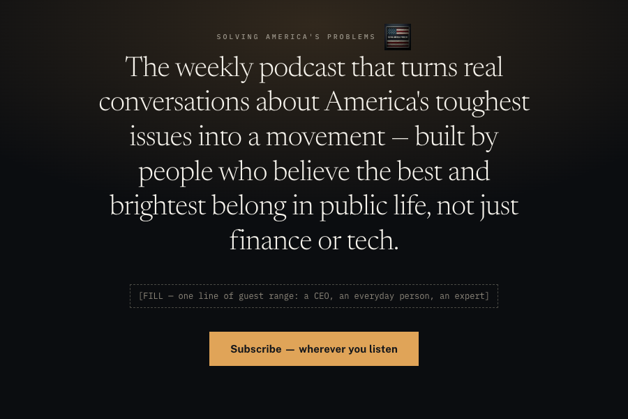

**Feeling.** The lamp still on at nine on a Sunday. Quiet, adult, unhurried — the room where you actually give something an hour.

**Layout.** One centred column, vertically centred, nothing in the corners. No nav, no rail, no second column. The eye has one path.

**Key visual choice.** A single pool of warm light behind the type instead of any image. The page is lit, not decorated — the only bright object on screen is the button.

[Full spec →](01-sunday-night.md)

---

## 02 · Broadsheet

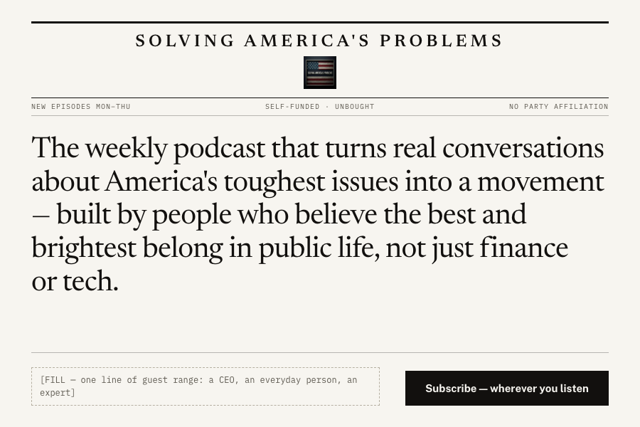

**Feeling.** A paper of record, not a channel. Serious on arrival — authority earned before a single claim is made.

**Layout.** Masthead, standing head, then the sentence as the front-page lead. The ask pinned to a bottom rule like a subscription line.

**Key visual choice.** Hairline rules and a standing head replace the navigation bar entirely. Cadence, self-funded and no-party sit where a paper puts its edition.

[Full spec →](02-broadsheet.md)

---

## 03 · Two Voices

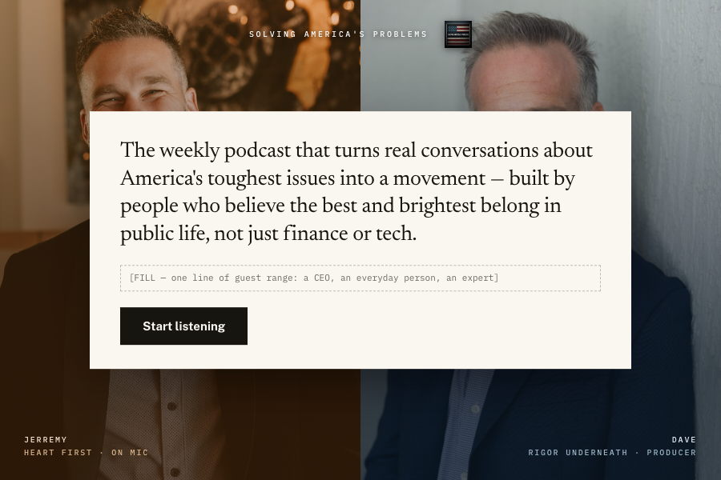

**Feeling.** Two people who disagree in public and stay in the room. Tension, not harmony — what makes this unlike a panel.

**Layout.** A hard 50/50 split, one host per half, sentence floated on a cream card straddling the seam. The button sits on neither side.

**Key visual choice.** The two halves are graded to different colour temperatures — warm left, cool right. The register difference is stated in light before a word is read.

[Full spec →](03-two-voices.md)

---

## 04 · Ballot

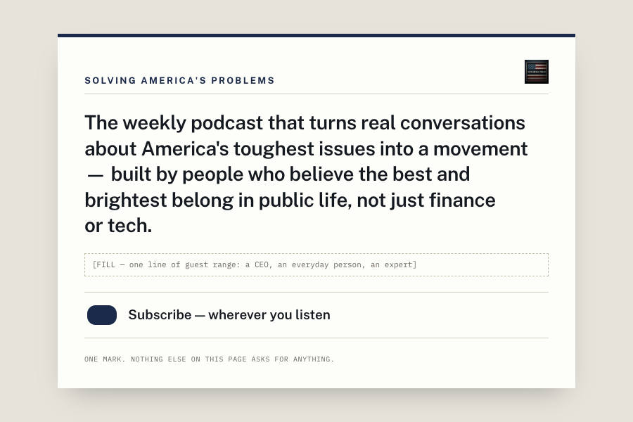

**Feeling.** A civic object you hold, not a brand that talks at you. Plain, procedural, faintly consequential.

**Layout.** A single sheet centred on a desk-toned ground. Ruled bands stack content the way a form stacks fields.

**Key visual choice.** The button is a filled ballot oval. Subscribing is drawn as casting one mark — generic civic stationery, no seal, no eagle.

[Full spec →](04-ballot.md)

---

## 05 · Waveform

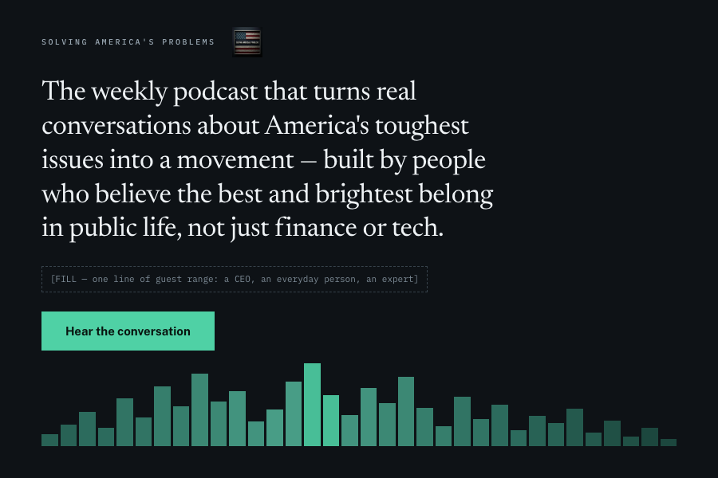

**Feeling.** Audio-first and unembarrassed about it. A studio, not a media company — the medium is the identity.

**Layout.** Type anchored top-left in a single measure; the lower band given entirely to sound. No photograph above the fold.

**Key visual choice.** A full-bleed waveform as the horizon line of the page — the only graphic element in the design, decaying left-to-right toward the button.

[Full spec →](05-waveform.md)

---

## 06 · Shop Sign

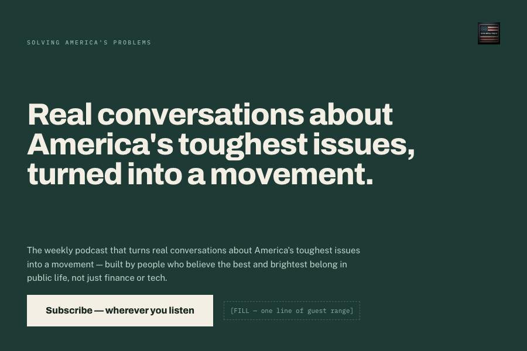

**Feeling.** Painted signage. Confident, plain-spoken, legible from across the street — 'shop sign English' taken literally.

**Layout.** Type only, edge to edge, three tiers: name, sign, ask. A flat painted surface with words on it.

**Key visual choice.** The only direction that splits the sentence: a 12-word sign at full scale, with the complete pitch verbatim beneath. The shortening test case.

[Full spec →](06-shop-sign.md)

---

## 07 · Transcript

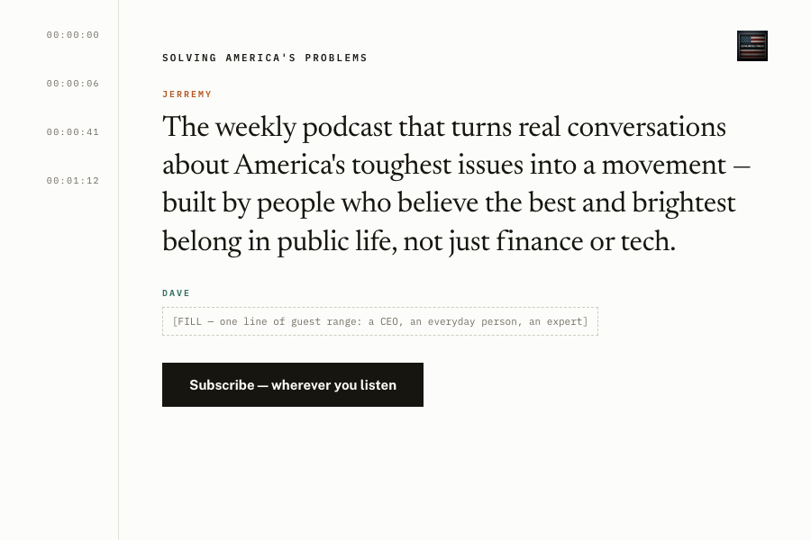

**Feeling.** You are already mid-conversation. Nothing is being marketed to you; you have opened a document of people talking.

**Layout.** A timecode gutter left, a single speaking column right. The sentence is Jerremy's opening line, the proof slot is Dave answering.

**Key visual choice.** Speaker labels in two accent colours. The two registers are structural rather than pictorial — you see there are two people before you meet either face.

[Full spec →](07-transcript.md)

---

## 08 · Kitchen Table

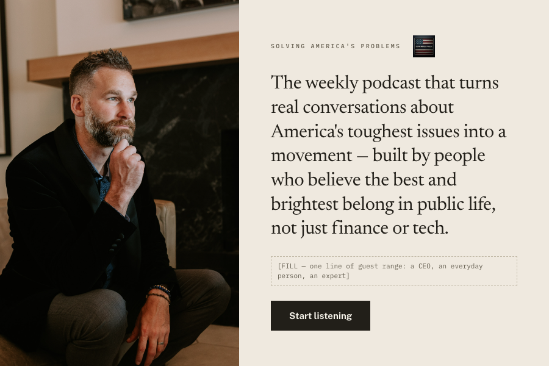

**Feeling.** Human before institutional. Someone is listening to you rather than addressing you — warm, close, unglamorous on purpose.

**Layout.** Photo left, words right, centred against each other, weighted 44/56 so type stays the subject and the photograph stays the company.

**Key visual choice.** The photograph bleeds off three edges with no frame, no rounding, no scrim, no tint. Nothing is done to the face at all.

[Full spec →](08-kitchen-table.md)

---

## 09 · The Question

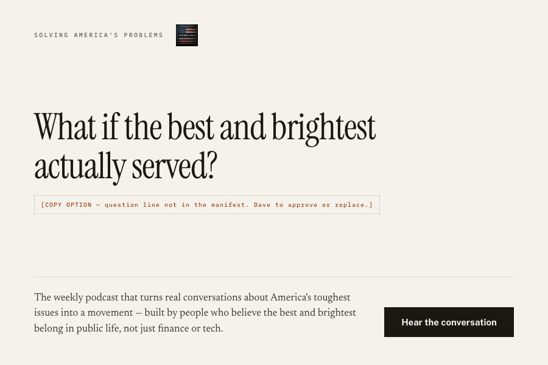

**Feeling.** Asked, not told. The one direction that opens by wondering aloud instead of declaring — the opposite of a lecture.

**Layout.** Inverted hierarchy: the question is the display object, the sentence sits below a rule as the answer. Question → answer → act.

**Key visual choice.** A high-contrast display serif at three and a half times body size, so scale carries the idea and no image is needed.

[Full spec →](09-the-question.md)

---

## 10 · Index

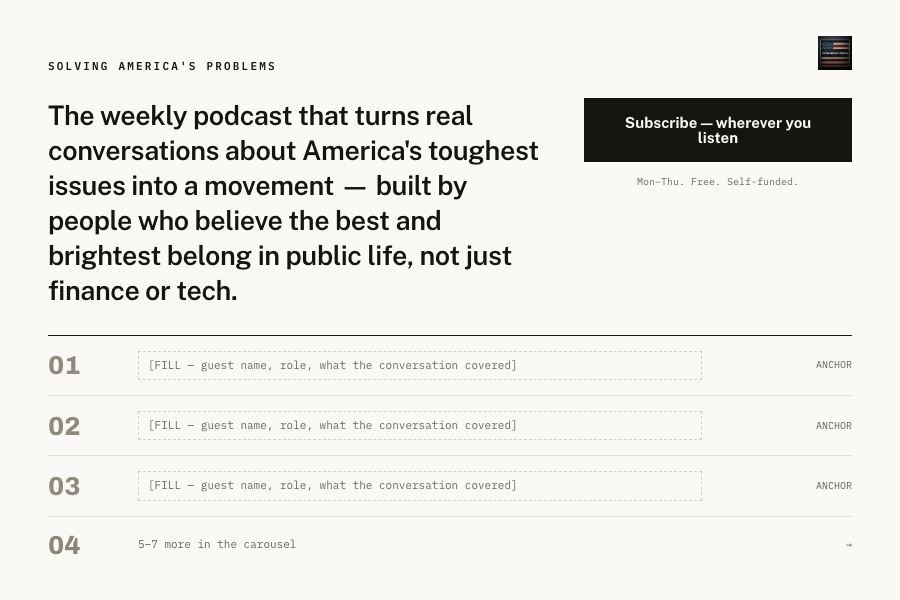

**Feeling.** A body of work, not a launch. Fifty-odd interviews deep and organised — library restraint rather than promotion.

**Layout.** Sentence and button in one band across the top, proof as a ruled table beneath. The only direction with proof visible above the fold.

**Key visual choice.** Heavy pale numerals as the dominant rhythm. Depth is drawn by counting, and the empty slots read honestly as an index awaiting entries.

[Full spec →](10-index.md)

---

## 11 · No Jersey

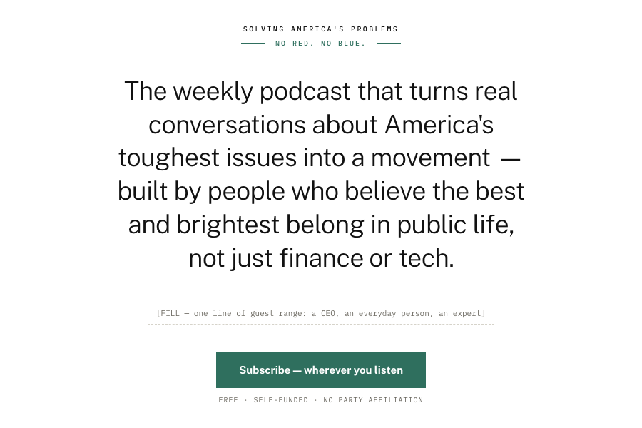

**Feeling.** Unaffiliated and calm about it. Cool, clean, almost clinical — the visual equivalent of refusing to pick a side out loud.

**Layout.** Strict central axis, air on all four sides, the two standing facts pinned to top and bottom edges. Symmetry does the work of neutrality.

**Key visual choice.** One accent for the whole page, deliberately neither red nor blue. **The only direction without the cover art** — a flag tile would negate the argument.

[Full spec →](11-no-jersey.md)

---

## 12 · Marquee

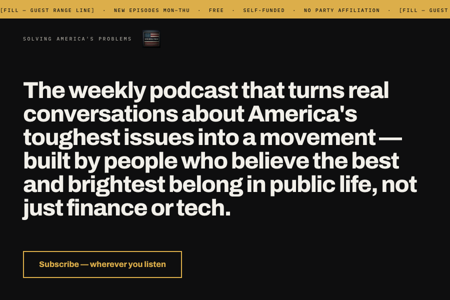

**Feeling.** Broadcast confidence. Loud, certain, a show that expects an audience — the highest-volume option, and the biggest tonal risk.

**Layout.** Three horizontal bands, nothing centred: ticker, name, sentence at maximum scale, then the ask. Type fills the frame like a title card.

**Key visual choice.** A ticker strip carries every standing fact and the proof line, which frees the hero of all secondary elements.

[Full spec →](12-marquee.md)

---

## 13 · Field Notes

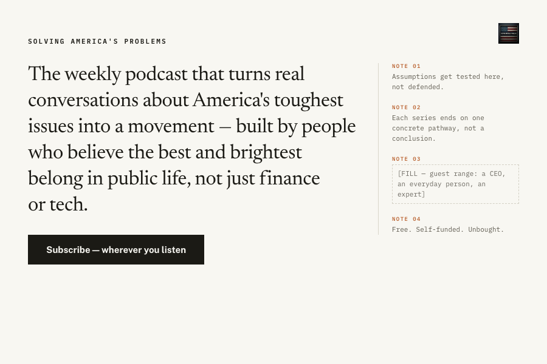

**Feeling.** Working papers left open on the desk. Rigorous, unfinished, thinking in public — the producer's side made visible.

**Layout.** A wide main measure with a narrow annotation rail right, divided by one hairline. Nothing in the rail competes for the click.

**Key visual choice.** Numbered marginalia in monospace beside the pitch. Claim and footnotes share the fold — a serious reader flattered without being lectured.

[Full spec →](13-field-notes.md)

---

## 14 · The Hour

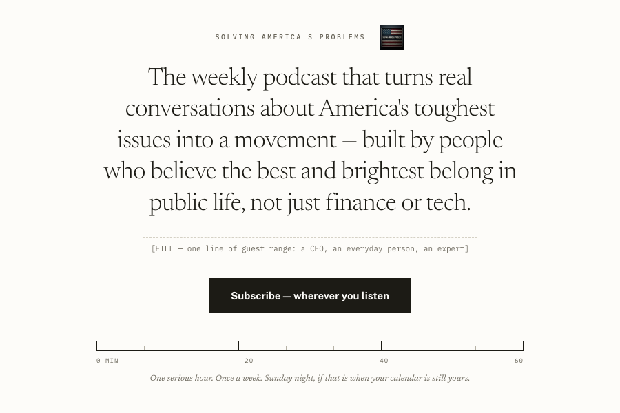

**Feeling.** Honest about the cost. It names the hour it wants instead of pretending the ask is free — the only one that negotiates with the calendar.

**Layout.** One narrow centred measure with generous air, and a measuring rule holding the base. Vertical rhythm reads as duration.

**Key visual choice.** A sixty-minute scale as the closing element. A ruler is the whole graphic language, turning 'no time for noise' into the page's own promise.

[Full spec →](14-the-hour.md)

---

## 15 · Threshold

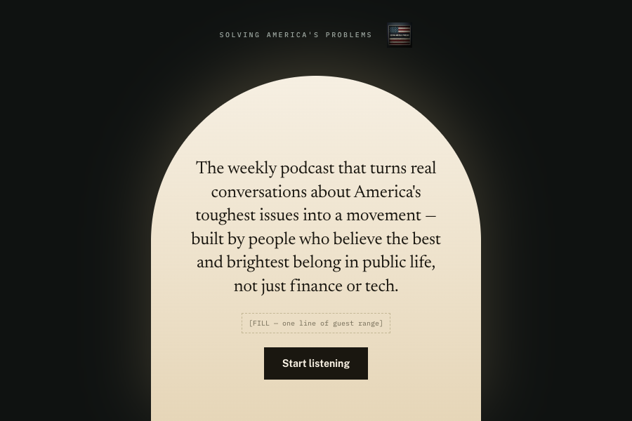

**Feeling.** An opening rather than an argument. Warm light from the other side of something — the show as the door.

**Layout.** A single arched aperture rising from the bottom edge holds all content; everything outside is dark and empty. The button sits inside the opening.

**Key visual choice.** The portal is drawn purely with one radius and a light gradient — no illustration, no photograph, no borrowed civic architecture.

[Full spec →](15-threshold.md)

---

## Before anything gets built

Four things are open. Three are Dave's calls, one is upstream housekeeping.

1. **The guest line.** Every direction shows an empty slot for it. Three anchor guests — name,
   role, one line on what the conversation covered. Range beats fame: one CEO, one everyday
   person, one expert. Nothing was invented, and nothing should be.
2. **Direction 09 needs one new line of copy** — a question. A placeholder is shown and flagged
   in the design. Approve it, replace it, or drop the direction.
3. **Direction 11 needs a mark that is not the flag.** Its whole argument is a palette with no red
   and no blue, so the cover art is deliberately absent. Separate brand work if it wins.
4. **The build manifest still contains banned copy.** Its elevator pitch closes on the career
   framing that Rosetta Stone v1.5 calls a hard fail — and the manifest instructs that pitch be
   used verbatim as the H1. That is very likely how the framing kept leaking back into thirty
   designs. The sentence above uses the corrected wording. Details and the exact fix:
   [`00-decisions-and-flags.md`](00-decisions-and-flags.md) § 1.

## Also worth knowing about the logo

The supplied artwork is **cover art, not a wordmark** — a dark photographic flag relief with the
name baked into the image. At header size on a light ground it reads as a small dark square and
the name inside it is illegible. So in every direction the name is set as type and the artwork
sits beside it at cover-art size, which is the role it actually plays. Nothing was redrawn.

If the show wants a mark that works small and on light backgrounds, that is a wordmark or
monogram — a separate piece of work from the cover art.

---

*No production code written. No stock photography, no generated faces, no generated logo.
Jerremy spelled with two r's throughout.*
