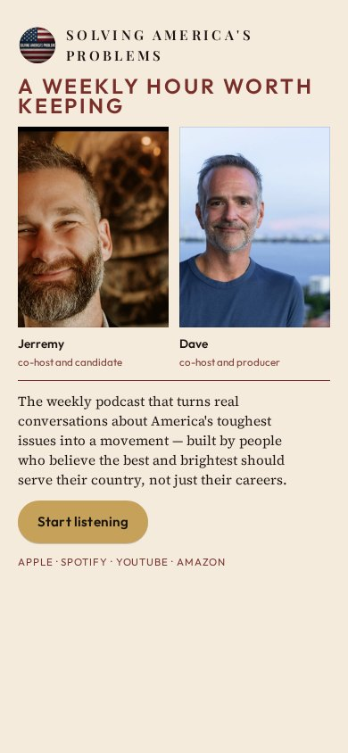
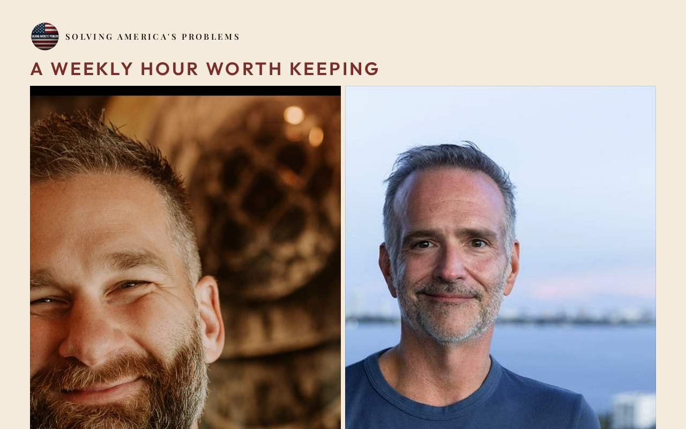

# 01 · Cover Story

Round-two living mock. Load `../../stage-3/START-HERE.md` before treating this as a source.

**Chip:** `#7A2E2A`  
**Hook as shown:** A weekly hour worth keeping

## Still

First viewport of the round-two mock. Real wordmark (transparent PNG) and real headshots. Locked sentence verbatim.

**Phone (390×844)**

**Desktop (1280×800)**

---

## Dave's verdict (round 3)

Not named as a keep. Masthead-at-top is a keep (logo). Hook is not the locked one. Do not remake as a magazine cover.

This set scored 2–3 / 10. Do not remake the room. Steal only what the verdict names.

---

## Feeling (as designed)

Madam Secretary on a Sunday nightstand. Adult, tailored, worth the hour. Not a campaign poster and not a quiet lamp.

---

## Layout (as designed)

Masthead wordmark at the top. Two equal cover portraits lead. Kicker sits above the locked sentence. Button in a caption bar. Phone stacks the portraits side by side so neither host becomes the show.

## Key visual (as designed)

Dual cover portraits at editorial scale — faces are the cover, not a thumbnail.

## Palette and type

| Token | Value |
|---|---|
| Ivory | `#F4EBDD` |
| Oxblood | `#7A2E2A` |
| Gold | `#C6A15A` |
| Ink | `#1C1410` |

**Type:** Playfair Display for the kicker and masthead. Outfit for the sentence and UI.

## Photos used

Standing frames: `Jerremy happy chest up.jpg`, `dave positive.jpg`.

Warm-Jerremy / cool-Dave was applied as a wash, never by recoloring the file. Roles only: Jerremy — co-host and candidate; Dave — co-host and producer.

## Copy on this page

- Hook: `A weekly hour worth keeping`
- Hook note: Magazine-cover faces plus a three-second kicker. The stop is prestige recognition — Jill would pick this up at a newsstand.
- H1: the locked sentence, verbatim
- Button: `Start listening`

## Hard fail if remaking

- Room photograph as a background
- Circular portraits or circular motifs
- Green (including emerald)
- Guests above the button
- Any hook except `Conversation becomes a movement`
- Short clipped bios
- "Near the ask" as visible copy
- Shade on people with jobs

## Not these other directions

This was one of fifteen rooms that shared a layout. The next round names treatments by visual *move* (scroll-reveal faces, kinetic headline, depth field), not by an evocative room name.
