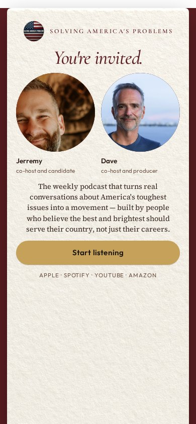
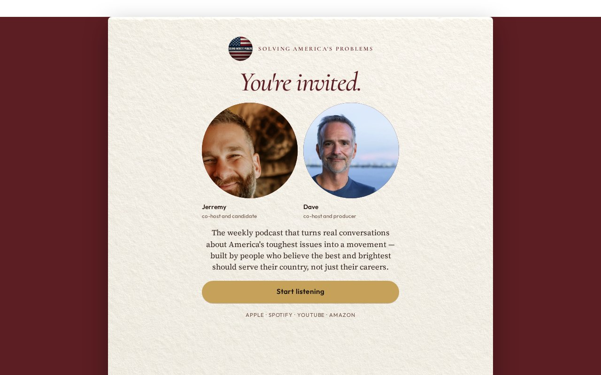

# 02 · The Invitation

Round-two living mock. Load `../../stage-3/START-HERE.md` before treating this as a source.

**Chip:** `#F6EFE4`  
**Hook as shown:** You're invited.

## Still

First viewport of the round-two mock. Real wordmark (transparent PNG) and real headshots. Locked sentence verbatim.

**Phone (390×844)**

**Desktop (1280×800)**

---

## Dave's verdict (round 3)

Kill. Hook reads as a party invite. Circular portraits are a hard fail going forward.

This set scored 2–3 / 10. Do not remake the room. Steal only what the verdict names.

---

## Feeling (as designed)

An envelope from people she already respects. Formal without being stiff. Dinner, not a funnel.

---

## Layout (as designed)

Centered invitation card on a deep wine ground. Two circular portraits as the hosts of the evening. The locked sentence is the body copy of the card. The gold button is the RSVP. Same object on phone; the card simply fills the width.

## Key visual (as designed)

The card as an object — paper, rule, portraits, reply.

## Palette and type

| Token | Value |
|---|---|
| Wine | `#5C1E22` |
| Ivory | `#F6EFE4` |
| Gold | `#C6A15A` |
| Ink | `#2A1A14` |

**Type:** Cormorant Garamond italic for the hook. Source Serif 4 for the sentence. Outfit for the button.

## Photos used

Circular crop of standing frames. Round 3 kills circular motifs — do not repeat.

Warm-Jerremy / cool-Dave was applied as a wash, never by recoloring the file. Roles only: Jerremy — co-host and candidate; Dave — co-host and producer.

## Copy on this page

- Hook: `You're invited.`
- Hook note: A personal card on a wine field. The stop is being chosen — not marketed to.
- H1: the locked sentence, verbatim
- Button: `Start listening`

## Hard fail if remaking

- Room photograph as a background
- Circular portraits or circular motifs
- Green (including emerald)
- Guests above the button
- Any hook except `Conversation becomes a movement`
- Short clipped bios
- "Near the ask" as visible copy
- Shade on people with jobs

## Not these other directions

This was one of fifteen rooms that shared a layout. The next round names treatments by visual *move* (scroll-reveal faces, kinetic headline, depth field), not by an evocative room name.
