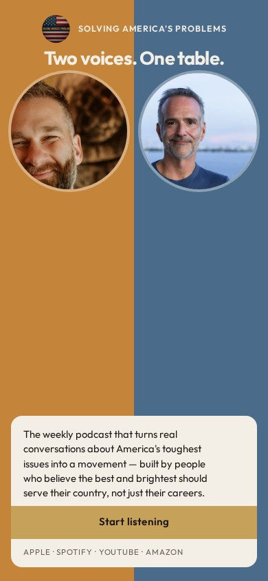
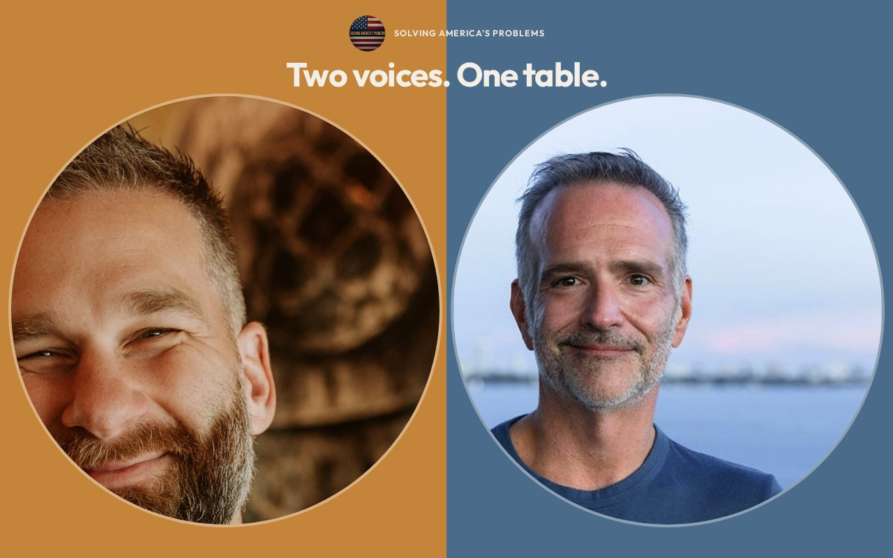

# 03 · Two Temperatures

Round-two living mock. Load `../../stage-3/START-HERE.md` before treating this as a source.

**Chip:** `#4A6B8A`  
**Hook as shown:** Two voices. One table.

## Still

First viewport of the round-two mock. Real wordmark (transparent PNG) and real headshots. Locked sentence verbatim.

**Phone (390×844)**

**Desktop (1280×800)**

---

## Dave's verdict (round 3)

Warm-Jerremy / cool-Dave pairing is a keep. The split-as-the-whole-page is not required. Hook is not the locked one.

This set scored 2–3 / 10. Do not remake the room. Steal only what the verdict names.

---

## Feeling (as designed)

Generous dual climate. Two instruments, one band. She can tell they are different people without being told who is 'heart' and who is 'head.'

---

## Layout (as designed)

Full-bleed split even on phone: Jerremy on amber, Dave on slate, portraits large and fully visible. Wordmark rides the seam. Sentence and button sit in a cream panel that straddles both rooms so the ask belongs to both.

## Key visual (as designed)

Split-tone as architecture. Washes over the photos, never recoloring them. Roles only.

## Palette and type

| Token | Value |
|---|---|
| Amber | `#C4843A` |
| Slate | `#4A6B8A` |
| Cream | `#F3EEE6` |
| Gold | `#C6A15A` |

**Type:** Outfit bold for the hook. Source Serif 4 for the sentence.

## Photos used

Standing frames with warm wash on Jerremy, cool wash on Dave.

Warm-Jerremy / cool-Dave was applied as a wash, never by recoloring the file. Roles only: Jerremy — co-host and candidate; Dave — co-host and producer.

## Copy on this page

- Hook: `Two voices. One table.`
- Hook note: The architectural split itself stops the scroll — warm and cool as climate, not as a jab.
- H1: the locked sentence, verbatim
- Button: `Start listening`

## Hard fail if remaking

- Room photograph as a background
- Circular portraits or circular motifs
- Green (including emerald)
- Guests above the button
- Any hook except `Conversation becomes a movement`
- Short clipped bios
- "Near the ask" as visible copy
- Shade on people with jobs

## Not these other directions

This was one of fifteen rooms that shared a layout. The next round names treatments by visual *move* (scroll-reveal faces, kinetic headline, depth field), not by an evocative room name.
