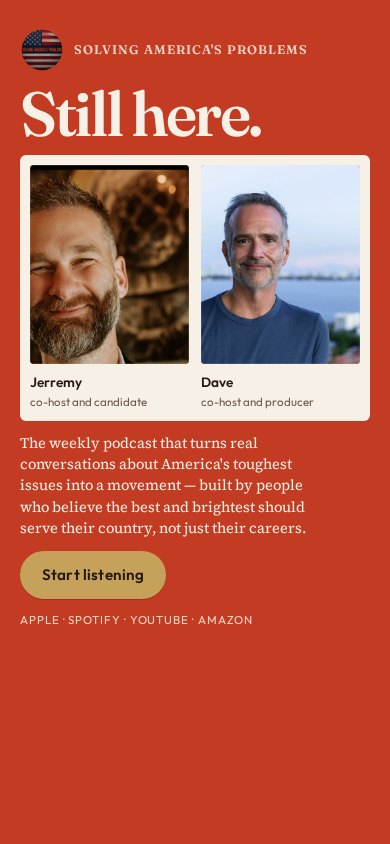
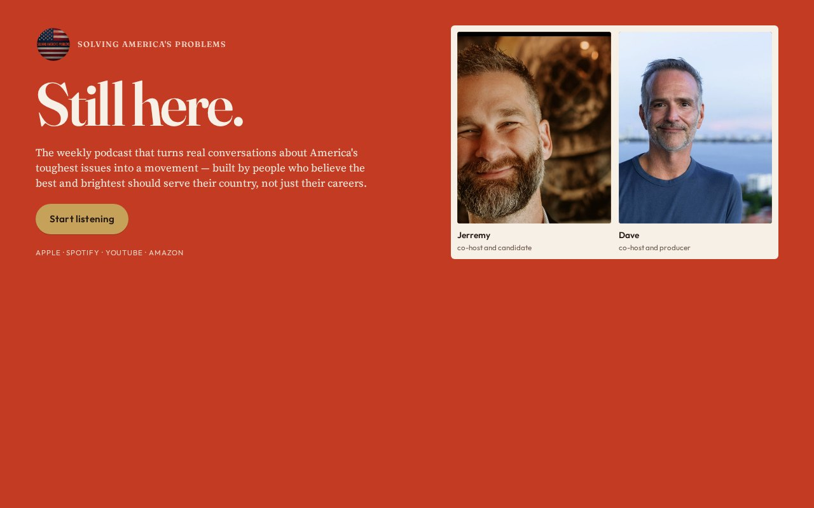

# 04 · Vermillion

Round-two living mock. Load `../../stage-3/START-HERE.md` before treating this as a source.

**Chip:** `#F7F0E6`  
**Hook as shown:** Still here.

## Still

First viewport of the round-two mock. Real wordmark (transparent PNG) and real headshots. Locked sentence verbatim.

**Phone (390×844)**

**Desktop (1280×800)**

---

## Dave's verdict (round 3)

Kill. Hook 'Still here' reads as if they went somewhere. Color-field-as-the-only-move is the round-2 failure mode.

This set scored 2–3 / 10. Do not remake the room. Steal only what the verdict names.

---

## Feeling (as designed)

A driving anthem in a color she would wear. Rich, unapologetic, still adult. Not a protest poster and not a bro brand.

---

## Layout (as designed)

Full-bleed vermillion field. Giant cream hook. Two portraits in a single cream plate so they stay a pair. Sentence in cream on the field. Gold button is the other bright object. Phone keeps the plate; type simply stacks.

## Key visual (as designed)

Color as the first-second hook. Faces protected inside a cream island.

## Palette and type

| Token | Value |
|---|---|
| Vermillion | `#C23B22` |
| Cream | `#F7F0E6` |
| Gold | `#C6A15A` |
| Charcoal | `#241814` |

**Type:** Bebas Neue for the hook. Source Serif 4 for the sentence. Outfit for UI.

## Photos used

Standing frames inside a cream plate.

Warm-Jerremy / cool-Dave was applied as a wash, never by recoloring the file. Roles only: Jerremy — co-host and candidate; Dave — co-host and producer.

## Copy on this page

- Hook: `Still here.`
- Hook note: The color is the stop. Defiant, not angry — Jill's loss-song, turned up.
- H1: the locked sentence, verbatim
- Button: `Start listening`

## Hard fail if remaking

- Room photograph as a background
- Circular portraits or circular motifs
- Green (including emerald)
- Guests above the button
- Any hook except `Conversation becomes a movement`
- Short clipped bios
- "Near the ask" as visible copy
- Shade on people with jobs

## Not these other directions

This was one of fifteen rooms that shared a layout. The next round names treatments by visual *move* (scroll-reveal faces, kinetic headline, depth field), not by an evocative room name.
