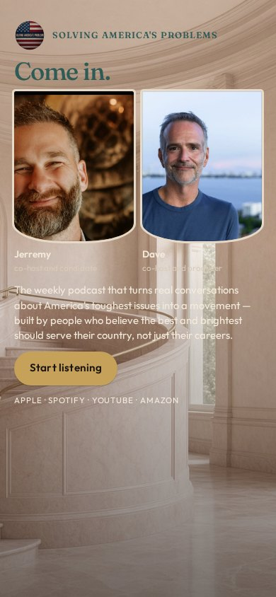
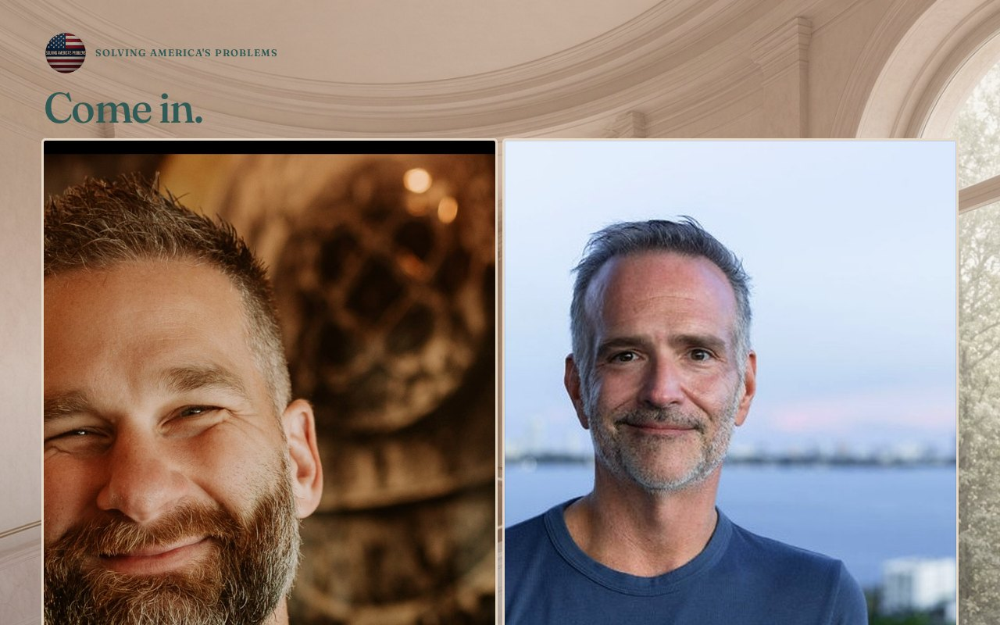

# 05 · The Landing

Round-two living mock. Load `../../stage-3/START-HERE.md` before treating this as a source.

**Chip:** `#C9A090`  
**Hook as shown:** Come in.

## Still

First viewport of the round-two mock. Real wordmark (transparent PNG) and real headshots. Locked sentence verbatim.

**Phone (390×844)**

**Desktop (1280×800)**

---

## Dave's verdict (round 3)

Kill. Room treatments are a kill category. Hook 'Come in' dies with the room. Teal/green-adjacent — avoid.

This set scored 2–3 / 10. Do not remake the room. Steal only what the verdict names.

---

## Feeling (as designed)

You have just stepped into a beautiful public building designed for people, not for power. Daylight, curve, stone. Feminine architecture. She belongs on the landing.

---

## Layout (as designed)

Room photograph as the field. Hosts stand on the foreground landing, equal and fully visible — never covering the faces with type. Hook in the upper air. Sentence and button in a stone-colored bar below the portraits. Phone crops the room, not the heads.

## Key visual (as designed)

The curve of the stair as the movement metaphor. Faces in front of the room, not buried in it.

## Palette and type

| Token | Value |
|---|---|
| Stone | `#E6D9C8` |
| Blush | `#C9A090` |
| Teal | `#2F5A56` |
| Gold | `#C6A15A` |

**Type:** Fraunces for the hook. Source Serif 4 for the sentence.

## Photos used

Standing frames over a generated civic interior. Room is a kill.

Warm-Jerremy / cool-Dave was applied as a wash, never by recoloring the file. Roles only: Jerremy — co-host and candidate; Dave — co-host and producer.

## Copy on this page

- Hook: `Come in.`
- Hook note: Arrival. A two-word invitation over a civic interior — movement as a place you walk into.
- H1: the locked sentence, verbatim
- Button: `Start listening`

## Hard fail if remaking

- Room photograph as a background
- Circular portraits or circular motifs
- Green (including emerald)
- Guests above the button
- Any hook except `Conversation becomes a movement`
- Short clipped bios
- "Near the ask" as visible copy
- Shade on people with jobs

## Not these other directions

This was one of fifteen rooms that shared a layout. The next round names treatments by visual *move* (scroll-reveal faces, kinetic headline, depth field), not by an evocative room name.
