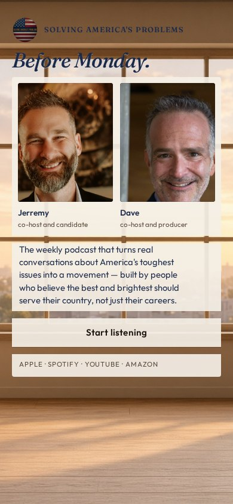
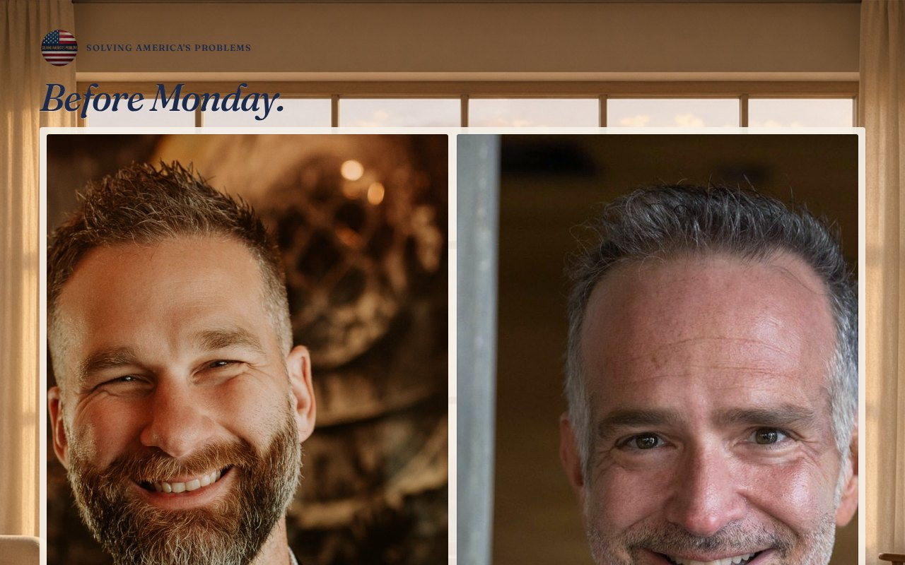

# 06 · Before Monday

Round-two living mock. Load `../../stage-3/START-HERE.md` before treating this as a source.

**Chip:** `#8A5A32`  
**Hook as shown:** Before Monday.

## Still

First viewport of the round-two mock. Real wordmark (transparent PNG) and real headshots. Locked sentence verbatim.

**Phone (390×844)**

**Desktop (1280×800)**

---

## Dave's verdict (round 3)

Keep the photo choices. Kill the room treatment. Kill the hook ('Before Monday' is confusing).

This set scored 2–3 / 10. Do not remake the room. Steal only what the verdict names.

---

## Feeling (as designed)

Sunday evening at the window. Golden hour, not a lamp. The calendar has not started. A serious conversation that does not compete with the workday.

---

## Layout (as designed)

Window and peach sky occupy the top of the frame; hook sits in the light. Hosts seated in the room below, equal. Sentence and button on the sill. Phone keeps the sky as a band, not a tiny strip.

## Key visual (as designed)

Window light instead of lamplight — same listening night, different room.

## Palette and type

| Token | Value |
|---|---|
| Peach sky | `#E8B48A` |
| Oak | `#8A5A32` |
| Navy type | `#1B2A4A` |
| Gold | `#C6A15A` |

**Type:** Fraunces italic for the hook. Outfit for the sentence.

## Photos used

KEEP THE FRAMES. Sitting: `Jerremy Neutral sitting 2.jpg`, `dave happy sitting.jpg`. Room photograph is dead; the seated expressions are the steal.

Warm-Jerremy / cool-Dave was applied as a wash, never by recoloring the file. Roles only: Jerremy — co-host and candidate; Dave — co-host and producer.

## Copy on this page

- Hook: `Before Monday.`
- Hook note: Time as belonging, not a clock. The stop is a phrase she already lives — the hour that is still hers.
- H1: the locked sentence, verbatim
- Button: `Start listening`

## Hard fail if remaking

- Room photograph as a background
- Circular portraits or circular motifs
- Green (including emerald)
- Guests above the button
- Any hook except `Conversation becomes a movement`
- Short clipped bios
- "Near the ask" as visible copy
- Shade on people with jobs

## Not these other directions

This was one of fifteen rooms that shared a layout. The next round names treatments by visual *move* (scroll-reveal faces, kinetic headline, depth field), not by an evocative room name.
