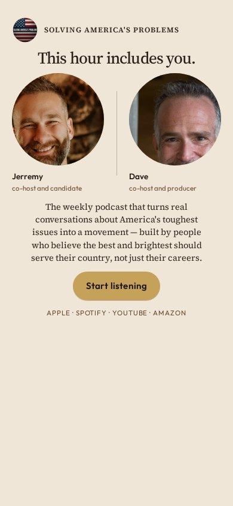
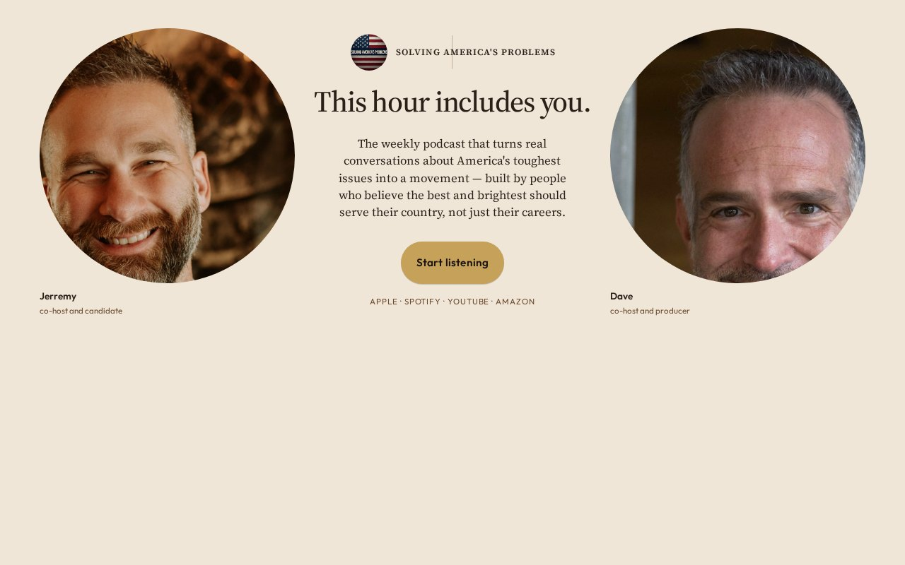

# 07 · Third Chair

Round-two living mock. Load `../../stage-3/START-HERE.md` before treating this as a source.

**Chip:** `#6B4A2E`  
**Hook as shown:** This hour includes you.

## Still

First viewport of the round-two mock. Real wordmark (transparent PNG) and real headshots. Locked sentence verbatim.

**Phone (390×844)**

**Desktop (1280×800)**

---

## Dave's verdict (round 3)

Kill the hook ('maybe'). Empty-chair / gap-as-furniture is the round-1 kill repeating. Faces are the mechanism, not the missing chair.

This set scored 2–3 / 10. Do not remake the room. Steal only what the verdict names.

---

## Feeling (as designed)

A table of three. She is not the audience. She is the other person in the conversation.

---

## Layout (as designed)

Two portraits at conversation distance with a deliberate gap. On desktop the hook and button live in the gap. On phone the gap becomes a horizontal pause between equal portraits, hook above, button below. No empty furniture as decoration.

## Key visual (as designed)

Negative space as the visitor's seat. Faces do the inviting.

## Palette and type

| Token | Value |
|---|---|
| Linen | `#EFE6D8` |
| Walnut | `#6B4A2E` |
| Slate | `#5A6E80` |
| Gold | `#C6A15A` |

**Type:** Source Serif 4 for hook and sentence. Outfit for roles and button.

## Photos used

Sitting frames.

Warm-Jerremy / cool-Dave was applied as a wash, never by recoloring the file. Roles only: Jerremy — co-host and candidate; Dave — co-host and producer.

## Copy on this page

- Hook: `This hour includes you.`
- Hook note: Two faces looking at you, with a gap that is yours. The stop is inclusion — not watching a show.
- H1: the locked sentence, verbatim
- Button: `Start listening`

## Hard fail if remaking

- Room photograph as a background
- Circular portraits or circular motifs
- Green (including emerald)
- Guests above the button
- Any hook except `Conversation becomes a movement`
- Short clipped bios
- "Near the ask" as visible copy
- Shade on people with jobs

## Not these other directions

This was one of fifteen rooms that shared a layout. The next round names treatments by visual *move* (scroll-reveal faces, kinetic headline, depth field), not by an evocative room name.
