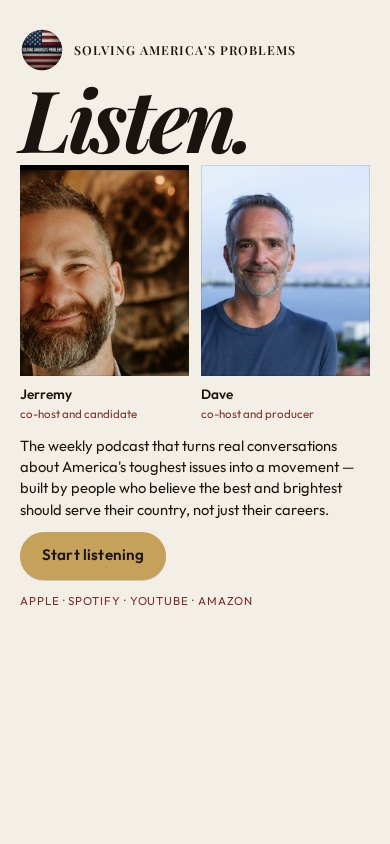
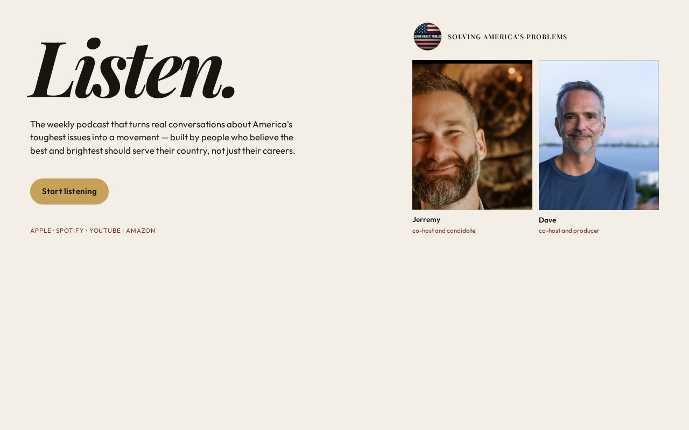

# 08 · Listen.

Round-two living mock. Load `../../stage-3/START-HERE.md` before treating this as a source.

**Chip:** `#1A1410`  
**Hook as shown:** Listen.

## Still

First viewport of the round-two mock. Real wordmark (transparent PNG) and real headshots. Locked sentence verbatim.

**Phone (390×844)**

**Desktop (1280×800)**

---

## Dave's verdict (round 3)

Kill. Hook 'Listen' is weird. Kinetic type is still wanted in round 4 — but not this word.

This set scored 2–3 / 10. Do not remake the room. Steal only what the verdict names.

---

## Feeling (as designed)

Direct and adult. A didone command, not a military stencil and not pod-bro shouting. She is being addressed, not barked at.

---

## Layout (as designed)

Cream field. The word is the architecture. Portraits sit under it, fully visible, equal. Sentence earns its place in a smaller measure. Button completes the verb. On desktop the word is left, faces right; on phone it stacks.

## Key visual (as designed)

Type as the room. Gold button as the only other bright object.

## Palette and type

| Token | Value |
|---|---|
| Cream | `#F4EFE6` |
| Ink | `#1A1410` |
| Gold | `#C6A15A` |
| Oxblood | `#7A2E2A` |

**Type:** Playfair Display 700 italic for the hook. Outfit for everything else.

## Photos used

Standing frames.

Warm-Jerremy / cool-Dave was applied as a wash, never by recoloring the file. Roles only: Jerremy — co-host and candidate; Dave — co-host and producer.

## Copy on this page

- Hook: `Listen.`
- Hook note: One word at billboard scale. The eye hits the word, then the faces, then the act.
- H1: the locked sentence, verbatim
- Button: `Start listening`

## Hard fail if remaking

- Room photograph as a background
- Circular portraits or circular motifs
- Green (including emerald)
- Guests above the button
- Any hook except `Conversation becomes a movement`
- Short clipped bios
- "Near the ask" as visible copy
- Shade on people with jobs

## Not these other directions

This was one of fifteen rooms that shared a layout. The next round names treatments by visual *move* (scroll-reveal faces, kinetic headline, depth field), not by an evocative room name.
