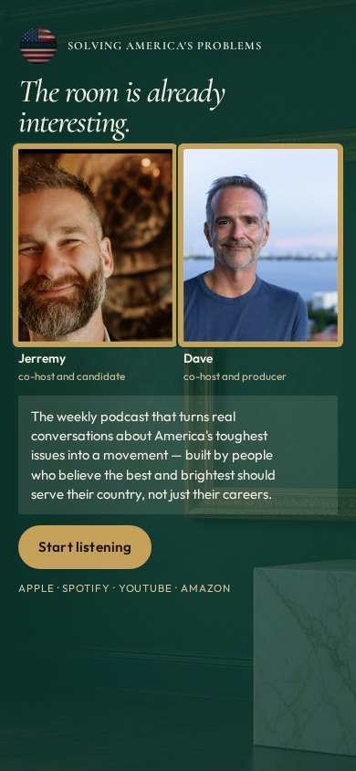
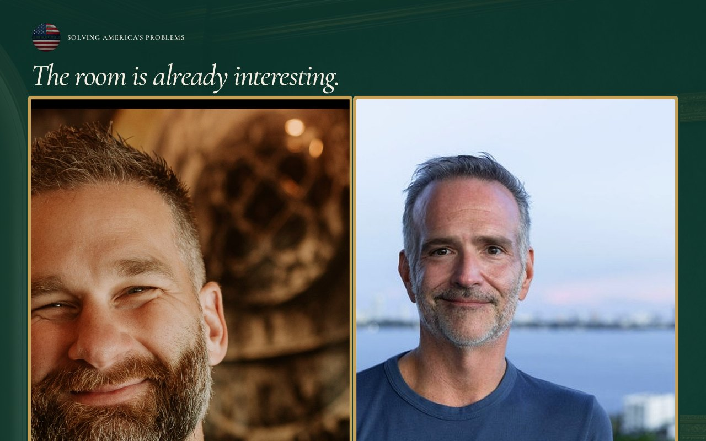

# 09 · The Salon

Round-two living mock. Load `../../stage-3/START-HERE.md` before treating this as a source.

**Chip:** `#C6A15A`  
**Hook as shown:** The room is already interesting.

## Still

First viewport of the round-two mock. Real wordmark (transparent PNG) and real headshots. Locked sentence verbatim.

**Phone (390×844)**

**Desktop (1280×800)**

---

## Dave's verdict (round 3)

Kill. Room treatment + green (Jerremy's other site). Do not use emerald, sage, or forest.

This set scored 2–3 / 10. Do not remake the room. Steal only what the verdict names.

---

## Feeling (as designed)

A high-flyer salon. Smart, social, beautiful. She thrives in rooms like this. The conversation is already good before she sits down.

---

## Layout (as designed)

Deep emerald field with the salon photograph as atmosphere. Two gold-framed portraits, equal. Sentence on a marble-colored panel. Gold button. Phone keeps the frames large; the room recedes.

## Key visual (as designed)

Framed faces on a rich color — gallery logic, not a podcast player.

## Palette and type

| Token | Value |
|---|---|
| Emerald | `#0F3D34` |
| Gold | `#C6A15A` |
| Cream | `#F3EDE2` |
| Walnut | `#5C3B22` |

**Type:** Cormorant Garamond for the hook. Outfit for the sentence.

## Photos used

Standing frames in gold frames. Emerald is green — hard fail going forward.

Warm-Jerremy / cool-Dave was applied as a wash, never by recoloring the file. Roles only: Jerremy — co-host and candidate; Dave — co-host and producer.

## Copy on this page

- Hook: `The room is already interesting.`
- Hook note: Emerald and gold at a glance. The stop is walking into Jill's world, not ours.
- H1: the locked sentence, verbatim
- Button: `Start listening`

## Hard fail if remaking

- Room photograph as a background
- Circular portraits or circular motifs
- Green (including emerald)
- Guests above the button
- Any hook except `Conversation becomes a movement`
- Short clipped bios
- "Near the ask" as visible copy
- Shade on people with jobs

## Not these other directions

This was one of fifteen rooms that shared a layout. The next round names treatments by visual *move* (scroll-reveal faces, kinetic headline, depth field), not by an evocative room name.
