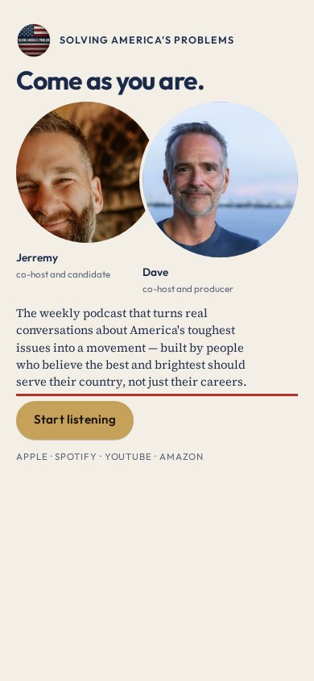
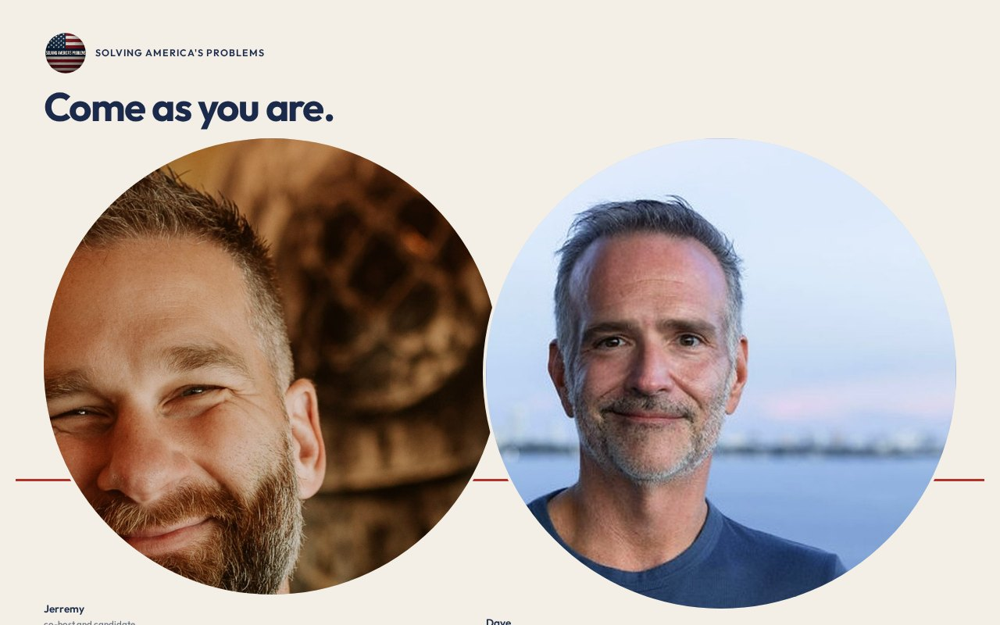

# 10 · Come as You Are

Round-two living mock. Load `../../stage-3/START-HERE.md` before treating this as a source.

**Chip:** `#F4EFE6`  
**Hook as shown:** Come as you are.

## Still

First viewport of the round-two mock. Real wordmark (transparent PNG) and real headshots. Locked sentence verbatim.

**Phone (390×844)**

**Desktop (1280×800)**

---

## Dave's verdict (round 3)

Keep the rich gold-blue-red palette (design's call against Jill, not Dave's). Kill the hook — it is a song lyric.

This set scored 2–3 / 10. Do not remake the room. Steal only what the verdict names.

---

## Feeling (as designed)

Civic, lowercase. Two people sharing a country. She does not have to pick a side to sit down.

---

## Layout (as designed)

Two portraits on one baseline, slightly overlapping at the shoulder — faces 100% clear. A single scarlet thread under both. Hook above. Sentence and button below. Phone keeps the shared baseline; nothing stacks into a solo poster.

## Key visual (as designed)

Two faces, one line. The thread is the only political color.

## Palette and type

| Token | Value |
|---|---|
| Navy | `#1B2A4A` |
| Cream | `#F4EFE6` |
| Scarlet | `#B13228` |
| Gold | `#C6A15A` |

**Type:** Outfit semibold for the hook. Source Serif 4 for the sentence.

## Photos used

Standing frames, overlapping at the shoulder.

Warm-Jerremy / cool-Dave was applied as a wash, never by recoloring the file. Roles only: Jerremy — co-host and candidate; Dave — co-host and producer.

## Copy on this page

- Hook: `Come as you are.`
- Hook note: Anti-tribal without a lecture. The stop is relief — no jersey is being handed over.
- H1: the locked sentence, verbatim
- Button: `Start listening`

## Hard fail if remaking

- Room photograph as a background
- Circular portraits or circular motifs
- Green (including emerald)
- Guests above the button
- Any hook except `Conversation becomes a movement`
- Short clipped bios
- "Near the ask" as visible copy
- Shade on people with jobs

## Not these other directions

This was one of fifteen rooms that shared a layout. The next round names treatments by visual *move* (scroll-reveal faces, kinetic headline, depth field), not by an evocative room name.
