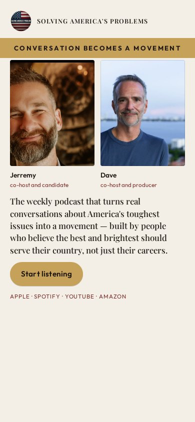
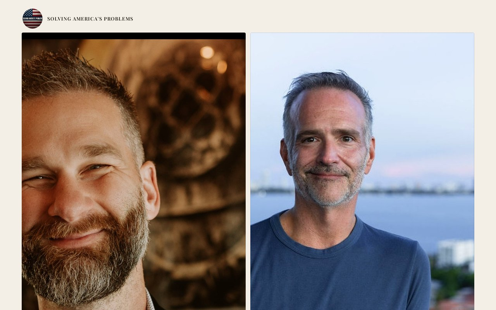

# 11 · The Ribbon

Round-two living mock. Load `../../stage-3/START-HERE.md` before treating this as a source.

**Chip:** `#C6A15A`  
**Hook as shown:** Conversation becomes a movement

## Still

First viewport of the round-two mock. Real wordmark (transparent PNG) and real headshots. Locked sentence verbatim.

**Phone (390×844)**

**Desktop (1280×800)**

---

## Dave's verdict (round 3)

THE KEEP. Banner at the top + the only hook worth keeping: 'Conversation becomes a movement.' Carry the hook and the banner-as-eye-path. Do not copy the rest of this layout as a default.

This set scored 2–3 / 10. Do not remake the room. Steal only what the verdict names.

---

## Feeling (as designed)

Procession. Something is already underway, and she can join it without a speech.

---

## Layout (as designed)

Cream field. A gold band carries the hook and threads behind the portraits (never over faces). The band terminates at the button — the single act. Sentence sits under the ribbon. Phone: ribbon as a full-width belt; faces above it, button at its end.

## Key visual (as designed)

Ribbon as eye-path. Layout rhythm, not ornament.

## Palette and type

| Token | Value |
|---|---|
| Cream | `#F3EEE6` |
| Gold | `#C6A15A` |
| Wine | `#7A2E2A` |
| Ink | `#1C1410` |

**Type:** Outfit small-caps on the ribbon. Playfair for the sentence.

## Photos used

Standing frames with the gold band behind (never over) the faces.

Warm-Jerremy / cool-Dave was applied as a wash, never by recoloring the file. Roles only: Jerremy — co-host and candidate; Dave — co-host and producer.

## Copy on this page

- Hook: `Conversation becomes a movement`
- Hook note: A gold ribbon of type runs through the composition and ends at the button. The stop is the path the eye is forced to walk.
- H1: the locked sentence, verbatim
- Button: `Start listening`

## Hard fail if remaking

- Room photograph as a background
- Circular portraits or circular motifs
- Green (including emerald)
- Guests above the button
- Any hook except `Conversation becomes a movement`
- Short clipped bios
- "Near the ask" as visible copy
- Shade on people with jobs

## Not these other directions

This was one of fifteen rooms that shared a layout. The next round names treatments by visual *move* (scroll-reveal faces, kinetic headline, depth field), not by an evocative room name.
