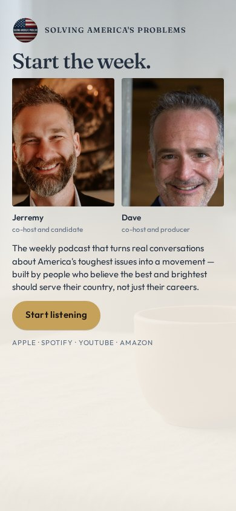
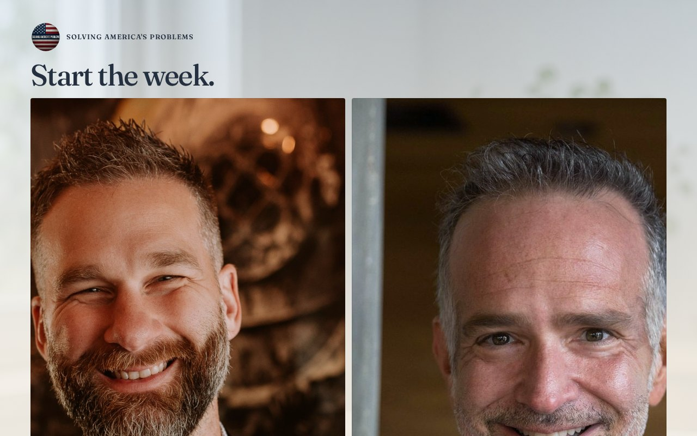

# 12 · Dawn Table

Round-two living mock. Load `../../stage-3/START-HERE.md` before treating this as a source.

**Chip:** `#F4EFE6`  
**Hook as shown:** Start the week.

## Still

First viewport of the round-two mock. Real wordmark (transparent PNG) and real headshots. Locked sentence verbatim.

**Phone (390×844)**

**Desktop (1280×800)**

---

## Dave's verdict (round 3)

Kill. Room treatment. Hook reads as a morning show.

This set scored 2–3 / 10. Do not remake the room. Steal only what the verdict names.

---

## Feeling (as designed)

Clear, productive, generous. The opposite room from a dim lamp. She can listen at 7am and still be herself.

---

## Layout (as designed)

Pale morning photograph as atmosphere. Two seated portraits across a linen table. Hook in sky blue-ink. Sentence on the table plane. Gold button as the cup of the morning — the one act. Phone keeps daylight; no cramped night crop.

## Key visual (as designed)

Daylight table. Time-of-day as the divergence from the quiet-room family.

## Palette and type

| Token | Value |
|---|---|
| Sky | `#D7E4EE` |
| Linen | `#F4EFE6` |
| Terracotta | `#C46A48` |
| Steel | `#4A6B8A` |

**Type:** Fraunces for the hook. Outfit for the sentence.

## Photos used

Sitting frames over a generated dawn interior. Room is a kill.

Warm-Jerremy / cool-Dave was applied as a wash, never by recoloring the file. Roles only: Jerremy — co-host and candidate; Dave — co-host and producer.

## Copy on this page

- Hook: `Start the week.`
- Hook note: Morning, not Sunday lamp. The stop is a different time of day — coffee, daylight, a serious hour before the noise.
- H1: the locked sentence, verbatim
- Button: `Start listening`

## Hard fail if remaking

- Room photograph as a background
- Circular portraits or circular motifs
- Green (including emerald)
- Guests above the button
- Any hook except `Conversation becomes a movement`
- Short clipped bios
- "Near the ask" as visible copy
- Shade on people with jobs

## Not these other directions

This was one of fifteen rooms that shared a layout. The next round names treatments by visual *move* (scroll-reveal faces, kinetic headline, depth field), not by an evocative room name.
