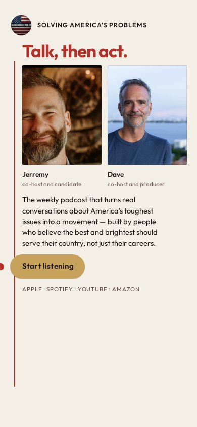
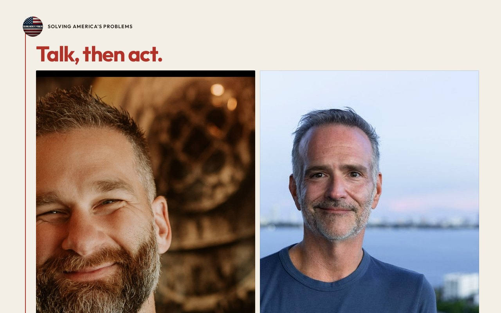

# 13 · The Thread

Round-two living mock. Load `../../stage-3/START-HERE.md` before treating this as a source.

**Chip:** `#B13228`  
**Hook as shown:** Talk, then act.

## Still

First viewport of the round-two mock. Real wordmark (transparent PNG) and real headshots. Locked sentence verbatim.

**Phone (390×844)**

**Desktop (1280×800)**

---

## Dave's verdict (round 3)

Kill the hook — a command that says little. Eye-path-to-the-button is still a keep principle (see 11).

This set scored 2–3 / 10. Do not remake the room. Steal only what the verdict names.

---

## Feeling (as designed)

Guiding principle made visible: talk is cheap unless it becomes a deed. Calm, not scolding.

---

## Layout (as designed)

Cream field. Portraits at the top. A thin scarlet line connects them, drops through the locked sentence, and ends at the gold button. On phone the line is vertical and never crosses a face. The eye is drawn to the one act a serious person can take.

## Key visual (as designed)

The funnel as a single drawn line.

## Palette and type

| Token | Value |
|---|---|
| Cream | `#F4EFE6` |
| Scarlet | `#B13228` |
| Ink | `#1A1410` |
| Gold | `#C6A15A` |

**Type:** Outfit for the hook. Source Serif 4 for the sentence.

## Photos used

Standing frames.

Warm-Jerremy / cool-Dave was applied as a wash, never by recoloring the file. Roles only: Jerremy — co-host and candidate; Dave — co-host and producer.

## Copy on this page

- Hook: `Talk, then act.`
- Hook note: A scarlet thread from the faces through the sentence to the button. The stop is inevitability — you can see where this is going.
- H1: the locked sentence, verbatim
- Button: `Start listening`

## Hard fail if remaking

- Room photograph as a background
- Circular portraits or circular motifs
- Green (including emerald)
- Guests above the button
- Any hook except `Conversation becomes a movement`
- Short clipped bios
- "Near the ask" as visible copy
- Shade on people with jobs

## Not these other directions

This was one of fifteen rooms that shared a layout. The next round names treatments by visual *move* (scroll-reveal faces, kinetic headline, depth field), not by an evocative room name.
