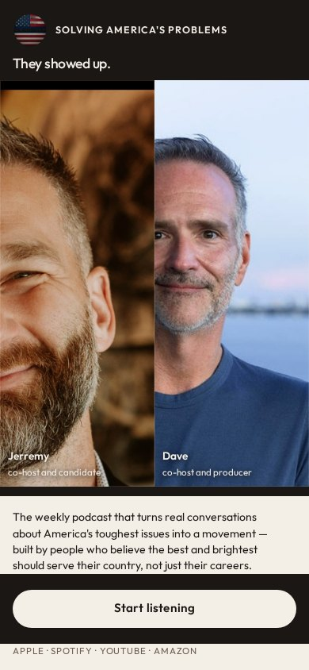
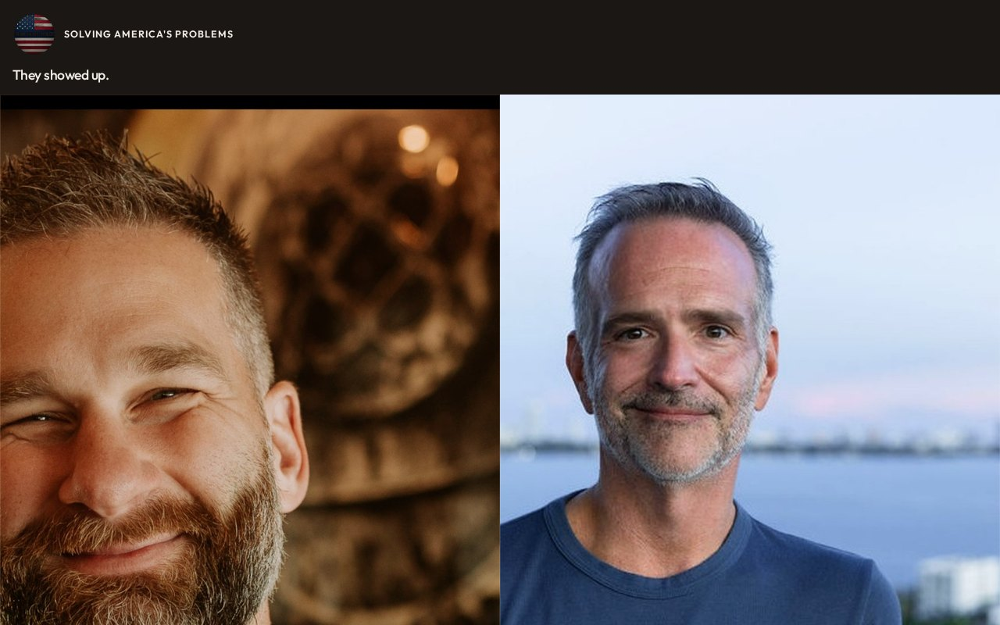

# 14 · Life Size

Round-two living mock. Load `../../stage-3/START-HERE.md` before treating this as a source.

**Chip:** `#F4EFE6`  
**Hook as shown:** They showed up.

## Still

First viewport of the round-two mock. Real wordmark (transparent PNG) and real headshots. Locked sentence verbatim.

**Phone (390×844)**

**Desktop (1280×800)**

---

## Dave's verdict (round 3)

Keep the big together-photos with name-and-title overlays — first treatment that did something different with the photos. Kill the hook ('They showed up' is wrong — they're already talking).

This set scored 2–3 / 10. Do not remake the room. Steal only what the verdict names.

---

## Feeling (as designed)

Human. You meet them. No room to hide in, no metaphor in the way. Both-and, never a solo giant.

---

## Layout (as designed)

Two full-bleed portrait columns, equal height. Wordmark as a small masthead. Hook is a whisper above the sentence. Sentence and button live in a cream bar below the chins — never a banner across the faces. Phone: two columns still, just shorter. Name-and-title overlays sit in the lower third of each portrait.

## Key visual (as designed)

Scale. The mechanism from round one, taken all the way.

## Palette and type

| Token | Value |
|---|---|
| Photo | `#2A2420` |
| Cream | `#F4EFE6` |
| Gold | `#C6A15A` |
| Cool wash | `#4A6B8A` |

**Type:** Outfit for all UI. The photographs carry the display role.

## Photos used

KEEP THE MOVE. Standing frames at hero scale with name + role overlays: Jerremy — co-host and candidate; Dave — co-host and producer. Files: `Jerremy happy chest up.jpg`, `dave positive.jpg`.

Warm-Jerremy / cool-Dave was applied as a wash, never by recoloring the file. Roles only: Jerremy — co-host and candidate; Dave — co-host and producer.

## Copy on this page

- Hook: `They showed up.`
- Hook note: Faces at nearly life size are the stop. The line is quiet on purpose — the portraits do the first second.
- H1: the locked sentence, verbatim
- Button: `Start listening`

## Hard fail if remaking

- Room photograph as a background
- Circular portraits or circular motifs
- Green (including emerald)
- Guests above the button
- Any hook except `Conversation becomes a movement`
- Short clipped bios
- "Near the ask" as visible copy
- Shade on people with jobs

## Not these other directions

This was one of fifteen rooms that shared a layout. The next round names treatments by visual *move* (scroll-reveal faces, kinetic headline, depth field), not by an evocative room name.
