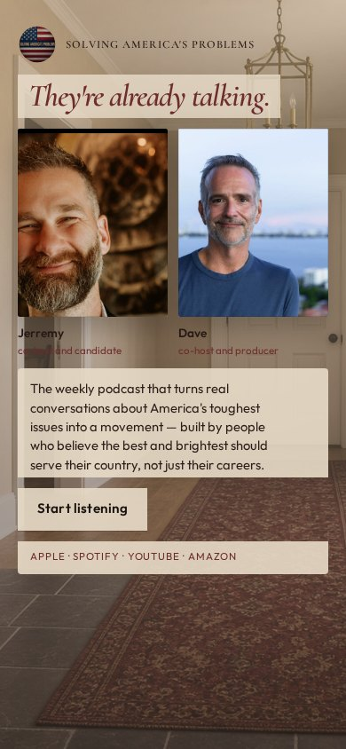
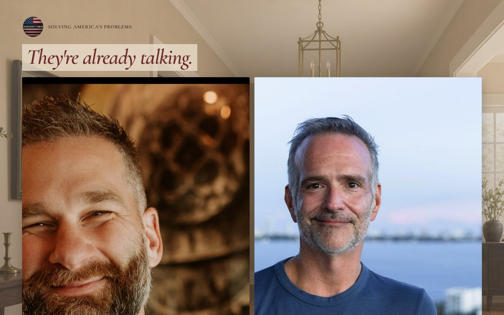

# 15 · The Foyer

Round-two living mock. Load `../../stage-3/START-HERE.md` before treating this as a source.

**Chip:** `#6E2C2C`  
**Hook as shown:** They're already talking.

## Still

First viewport of the round-two mock. Real wordmark (transparent PNG) and real headshots. Locked sentence verbatim.

**Phone (390×844)**

**Desktop (1280×800)**

---

## Dave's verdict (round 3)

Kill. Room treatment. The line 'They're already talking' is closer to the truth than 'They showed up,' but it is not the hook to keep.

This set scored 2–3 / 10. Do not remake the room. Steal only what the verdict names.

---

## Feeling (as designed)

You opened the door of a home where the interesting people started without waiting. Oxblood runner, plaster, brass. She is a guest, not a constituent.

---

## Layout (as designed)

Foyer photograph as the field. Hosts stand as if greeting, equal, fully visible in the foreground. Hook as a line on the wall. Sentence and button on a plaster card. Phone crops the hall, not the heads.

## Key visual (as designed)

Domestic threshold — distinct from the civic landing.

## Palette and type

| Token | Value |
|---|---|
| Plaster | `#E8DCC8` |
| Oxblood | `#6E2C2C` |
| Brass | `#C6A15A` |
| Slate | `#4A5560` |

**Type:** Cormorant Garamond for the hook. Outfit for the sentence.

## Photos used

Standing frames over a generated foyer. Room is a kill.

Warm-Jerremy / cool-Dave was applied as a wash, never by recoloring the file. Roles only: Jerremy — co-host and candidate; Dave — co-host and producer.

## Copy on this page

- Hook: `They're already talking.`
- Hook note: A house, not a temple. The stop is arriving mid-conversation — in a good way.
- H1: the locked sentence, verbatim
- Button: `Start listening`

## Hard fail if remaking

- Room photograph as a background
- Circular portraits or circular motifs
- Green (including emerald)
- Guests above the button
- Any hook except `Conversation becomes a movement`
- Short clipped bios
- "Near the ask" as visible copy
- Shade on people with jobs

## Not these other directions

This was one of fifteen rooms that shared a layout. The next round names treatments by visual *move* (scroll-reveal faces, kinetic headline, depth field), not by an evocative room name.
