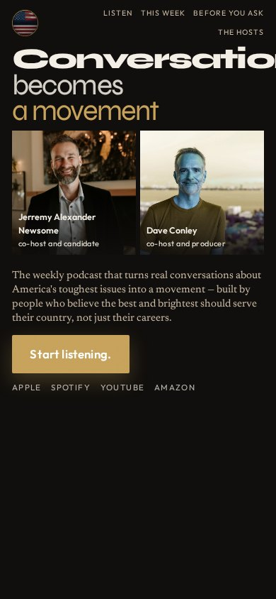
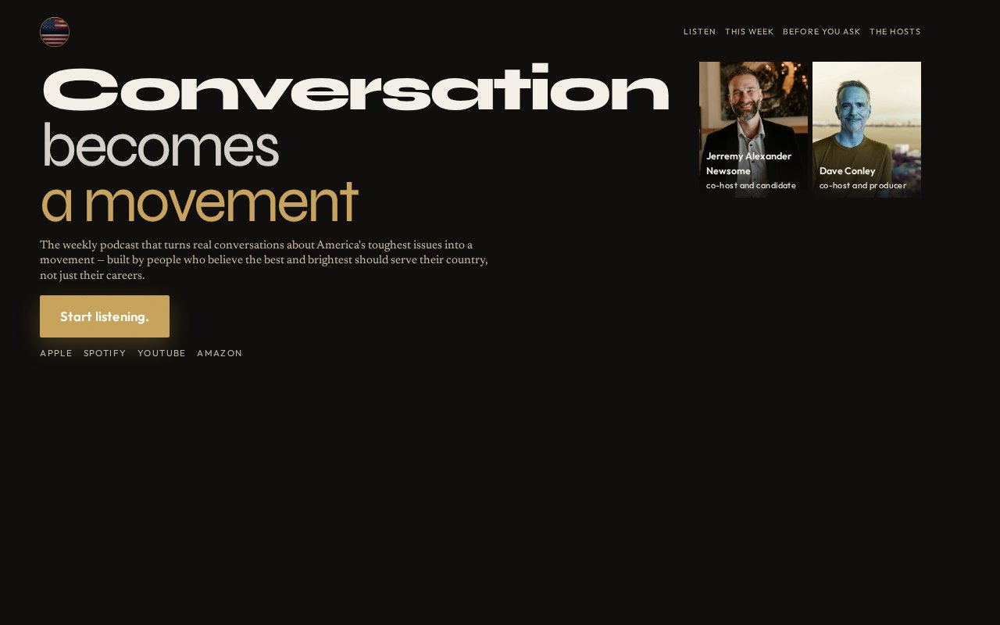

# 01 · Kinetic Headline

**Move:** Variable-font weight shifts on scroll so the hook performs the conversion.  
**Why it wins with Jill over the others:** She is type-literate (Madam Secretary gravitas, magazine fluency). Giant true words stop her before a photograph can, and the motion *is* the argument — conversation becoming a movement as her thumb nears the button.

## Still

**Phone (390×844)**

**Desktop (1280×800)**

## Feeling

Title sequence, not a landing page. Adult. Architectural. The page is already in motion when she arrives. 3PM: a conversation worth the hour, said at full size. 3AM (unnamed): the words are going somewhere.

## Layout logic

Phone, one column, one decision:

1. Seal + typographic index
2. Hook as three stacked lines occupying the first seconds
3. Two standing portraits, equal, name/role overlays — identification, not a second ask
4. Locked sentence
5. **Start listening.** in the thumb zone
6. Platform whisper

Desktop: hook + sentence + button on the left; portraits as a pair on the right. Same eye path. No second CTA.

Scroll: `animation-timeline: scroll()`. “Conversation” starts heavy and lightens; “a movement” starts light and lands at 800. `prefers-reduced-motion` freezes the weights.

Funnel below, never competing in the hero.

## Named visual move

Kinetic headline. Variable font (Syne) as architecture. Not decoration on a quiet room.

## Palette

| Token | Value |
|---|---|
| Ground | `#100E0C` |
| Ivory | `#F4EFE6` |
| Gold | `#C6A15A` (button, “a movement”) |
| Stamp red | inside the wordmark only |

No green. No navy-gold consulting field.

## Type

- Display: Syne variable, tight tracking, three lines
- Sentence: Newsreader, ~15px, the locked H1
- UI: Outfit

## Navigation concept + labels

**Typographic index** — a table of contents, not a hamburger. Labels map to funnel sections. Listen is listed because this treatment’s chrome is an index; the button remains the only ask.

Proposed labels: **Listen · This week · Before you ask · The hosts**

## Section justifications (or cut)

- Hook as kinetic type — moves Jill to recognize the show in one to three seconds, then to the button.
- Standing portraits with role overlays — identification after the hook, before the tap; faces were a keep.
- Locked sentence — earns the tap with the actual offer, not a paraphrase.
- Button in thumb zone — the only ask above the fold.
- When you're ready / social / resources / this week / before you ask / bios / guests — sequenced after the tap so a second action exists without competing.

## Hard-fail check

- [x] No room photograph
- [x] No circles
- [x] No green
- [x] No childish treatment
- [x] Guests at the bottom
- [x] No “Near the ask”
- [x] Jerremy two r’s; roles honest
- [x] Locked sentence verbatim as H1
- [x] No email in the hero
- [x] One CTA above the fold
- [x] Phone-first; button visible in 390×844
- [x] No 2014 scroll-hijack
