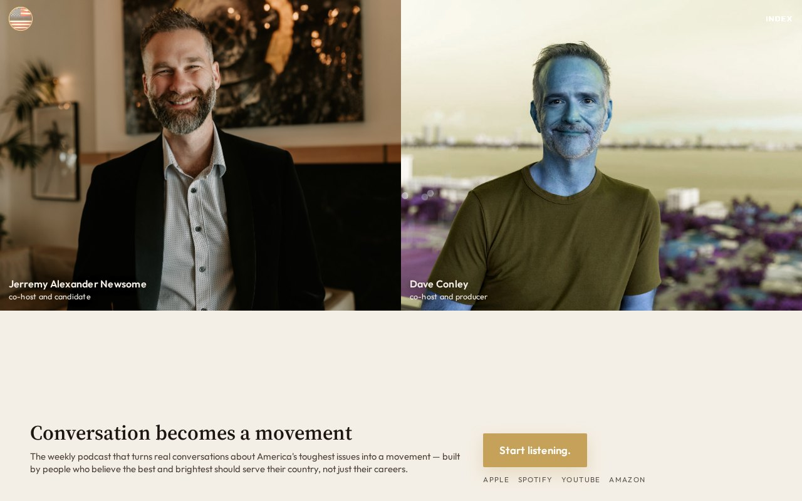

# 02 · Scroll-Reveal Faces

**Move:** Clip-path portrait reveal on load; name-and-title overlays; faces *are* the architecture.  
**Why it wins with Jill over the others:** Faces were the mechanism that landed three prior rounds. This is the first treatment that makes their *arrival* the event, not a static crop under a sentence.

## Still

**Phone (390×844)**

**Desktop (1280×800)**

## Feeling

You walked in mid-conversation. Two adults already looking at you. No costume. 3PM: I can tell who is in the room. 3AM (unnamed): I would not be the only adult at the table.

## Layout logic

Phone: two stacked full-width standing portraits (54svh combined) so the cream bar — hook, locked sentence, button — stays in the first viewport. Name and role sit in the lower third of each portrait (steal from round-2 14, not a remake).

Desktop: two equal columns. Cream bar under the chins holds hook + sentence + the single ask.

Load: `clip-path` opens in 1.1s. Reduced motion: already open.

Warm wash on Jerremy, cool wash on Dave — overlay, never recoloring the file.

## Named visual move

Scroll-reveal faces. The page opens by looking at her.

## Palette

| Token | Value |
|---|---|
| Photo field | `#0E0C0A` |
| Cream bar | `#F4EFE6` |
| Ink | `#1C1410` |
| Gold button | `#C6A15A` |
| Warm / cool | sepia wash / slate wash |

Rich, not mute. Not consulting navy-and-gold.

## Type

- Hook: Source Serif 4
- Sentence / UI: Outfit
- Photographs carry display scale

## Navigation concept + labels

**Photo-overlay Index.** A text control on the portraits opens a full-bleed type menu (view-transition territory). Not a hamburger icon.

Proposed labels: **Listen · This week · Who we are · Before you ask**

## Section justifications (or cut)

- Reveal portraits — stop the scroll with two real people, equal, fully visible.
- Cream bar — one decision: the sentence and the tap, after identification.
- Index menu — wayfinding without a second ask in the hero.
- Funnel after the fold — secondary metric lives downstairs.

## Hard-fail check

- [x] No room photograph (studio portraits, not interiors)
- [x] No circles / no circle-crop
- [x] No green
- [x] Faces fully visible, equal size
- [x] Guests never above the button
- [x] Locked hook only
- [x] Phone-first; button in first viewport
- [x] Jerremy two r’s; candidate / producer roles
