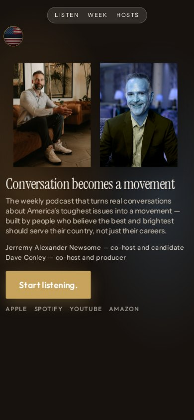
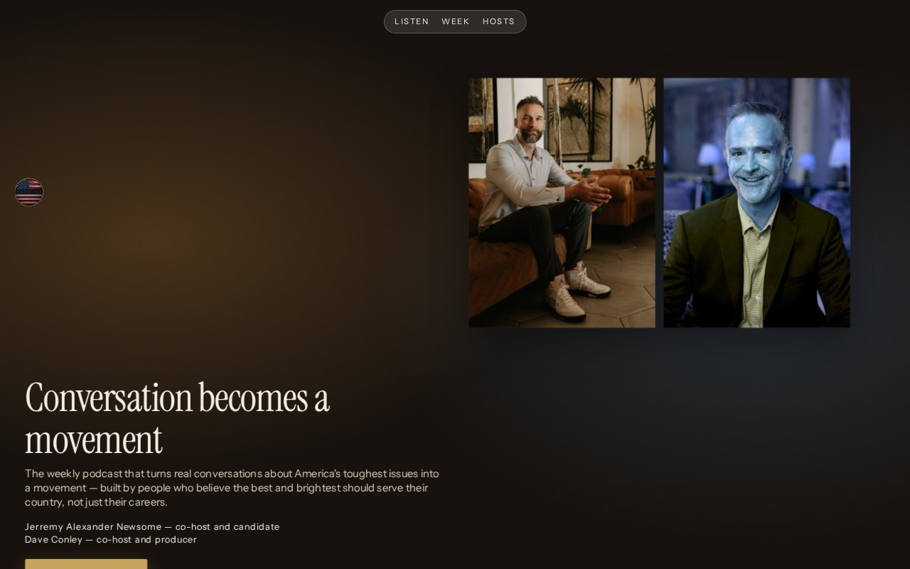

# 03 · Depth Field

**Move:** CSS 3D planes. Wordmark, sitting portraits, hook, and button occupy different `translateZ`; scroll drives depth.  
**Why it wins with Jill over the others:** Every prior round was a flat card. Depth is the 2026 gap — cinematic layering without a room photograph, which this avatar would punish as theater.

## Still

**Phone (390×844)**

**Desktop (1280×800)**

## Feeling

A field, not a page. Things occupy space. Quietly expensive. 3PM: this was made with care. 3AM (unnamed): seriousness can have dimension.

## Layout logic

`perspective: 1400px` on the hero.

- Far plane: warm/cool radial field + grain (not a room)
- Mid plane: sitting keep frames as cards — `Jerremy Neutral sitting 2.jpg`, `dave happy sitting.jpg`
- Near plane: hook + locked sentence + button

Scroll translates Z. Native `animation-timeline: scroll()`. No scroll-jacking. Reduced motion: static planes.

Desktop: copy left, cards right, glass pill nav on the nearest plane.

## Named visual move

Depth field. Z-axis as layout, not ornament.

## Palette

| Token | Value |
|---|---|
| Umber | `#16110D` |
| Ivory type | `#F6F0E6` |
| Amber wash | `#C4843A` (Jerremy plane) |
| Slate wash | `#4A6B8A` (Dave plane) |
| Gold button | `#C6A15A` |

Washes are climate, not jabs. No green.

## Type

- Hook: Instrument Serif
- Sentence / UI: Instrument Sans
- Two families, one band

## Navigation concept + labels

**Floating glass pill** that lives on the nearest plane. Three labels only — this treatment cannot carry a long index without cluttering the field.

Proposed labels: **Listen · Week · Hosts**

(Week = this week. Hosts = bios. Before you ask is reached by scroll, not chrome.)

## Section justifications (or cut)

- Depth planes — stop the scroll with space, not a template.
- Sitting portraits as cards — identification without flattening into a hero crop.
- Glass pill — wayfinding that belongs to the move; not a second ask.
- Button nearest the eye — eye-drawing principle in Z.

## Hard-fail check

- [x] No room photograph (abstract field, not an interior)
- [x] No circles
- [x] No green
- [x] No 2014 parallax hijack
- [x] Glassmorphism used once, on the pill
- [x] Phone-first; button in first viewport
- [x] Guests at the bottom
- [x] Locked copy
