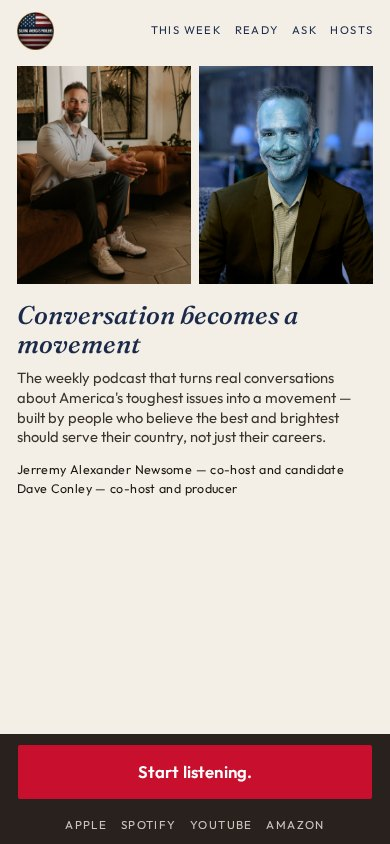
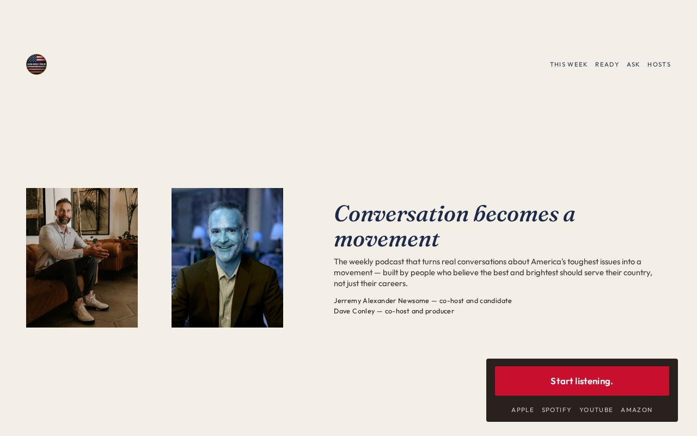

# 04 · Sticky Thumb

**Move:** Persistent thumb-zone dock. The single CTA never leaves her hand. Chrome is the architecture.  
**Why it wins with Jill over the others:** Takes the eye-drawing principle all the way. She is busy. She should not hunt for the act. Manufactured urgency is forbidden; physical convenience is not.

## Still

**Phone (390×844)**

**Desktop (1280×800)**

## Feeling

Respect. The ask is already in her hand, the way a well-made tool is. Cream, gold, slate — the rich palette from the round-2 keep, used as climate not costume. 3PM: I know exactly what to tap. 3AM (unnamed): someone designed for my actual life.

## Layout logic

Phone:

- Masthead: seal + nav that does **not** include Listen
- Sitting portraits, equal, warm/cool wash
- Hook in Fraunces italic
- Locked sentence
- **Dock:** Start listening. + platform whisper. Fixed to the thumb. Same ask, never a second one

Desktop: the dock becomes a right-bottom instrument panel, not a banner. Photos left, type right.

Funnel scrolls under the dock. When you're ready is a quiet form, visually lighter than the dock, so it cannot compete.

## Named visual move

Sticky thumb. Chrome-as-architecture.

## Palette

| Token | Value |
|---|---|
| Cream | `#F3EEE6` |
| Navy type | `#1B2A4A` (type only — not a consulting field) |
| Stamp | `#C8102E` (dock button) |
| Gold | `#C6A15A` |
| Ink | `#1C1410` |

Gold-blue-red keep from round-2 10, used without civic marble.

## Type

- Hook: Fraunces italic
- Sentence / UI: Outfit

## Navigation concept + labels

**The dock is Listen.** Top nav never repeats the ask. That is the whole concept.

Proposed labels: **This week · Ready · Ask · Hosts**

## Section justifications (or cut)

- Dock — the primary metric, physically unmissable.
- Sitting portraits — they were already talking; identification without a campaign poster.
- Top nav without Listen — protects one-decision-per-viewport.
- Funnel downstairs — secondary metric after the tap.

## Hard-fail check

- [x] No fake urgency, no timer
- [x] Dock is the same ask, not a second one
- [x] No room photograph
- [x] No circles / no green
- [x] No email in the hero
- [x] Phone-first
- [x] Guests at the bottom
- [x] Locked copy
