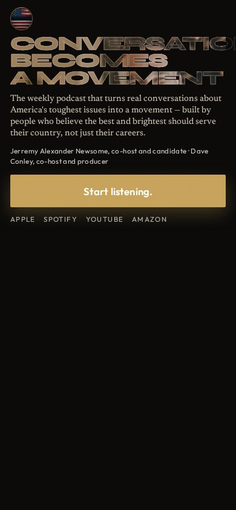
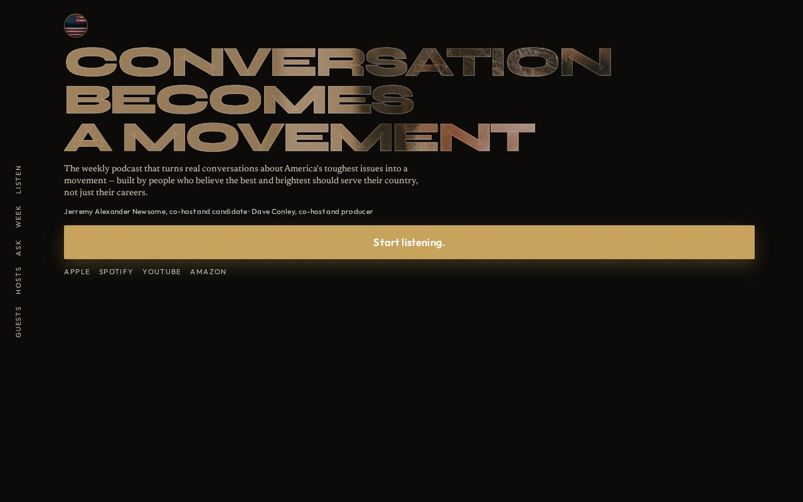

# 05 · Masked Type

**Move:** The hook letterforms are the host photographs via `background-clip: text`. Type and faces stop competing.  
**Why it wins with Jill over the others:** One object does both jobs. This is 2026 editorial craft she already trusts from magazine culture — not a podcast thumbnail, not a quiet room.

## Still

**Phone (390×844)**

**Desktop (1280×800)**

## Feeling

Poster. Black dress. The people *are* the sentence. 3PM: this was designed, not templated. 3AM (unnamed): seriousness can be beautiful without becoming a rally.

## Layout logic

The hook is three lines of Syne ExtraBold, uppercase, filled with the standing keep frames (warm Jerremy in the first line, cool Dave in the last, gold climate through “becomes”). A hairline stroke keeps the lettering legible if the fill goes quiet.

Locked sentence underneath as H1. Roles on one line. Button in the thumb zone.

Desktop: a **spine** of vertical labels along the left edge. Phone: spine collapses; the button is Listen, so chrome does not repeat it.

No portrait boxes in the hero — that would be a second treatment glued on. Faces live inside the words; full portraits return in the bios.

## Named visual move

Masked type. Letterforms as window.

## Palette

| Token | Value |
|---|---|
| Ground | `#0B0A09` |
| Fill | standing photographs + gold/slate climate |
| Ivory | `#F7F2EA` |
| Gold button | `#C6A15A` |

## Type

- Mask: Syne 800, uppercase
- Sentence: Newsreader
- Spine / UI: Outfit

## Navigation concept + labels

**Spine.** Vertical one-word labels on desktop. Phone omits the row so the type can breathe; the spine is the concept, not a five-item wrap.

Proposed labels: **Listen · Week · Ask · Hosts · Guests**

Guests is in the spine because this treatment can afford a last-item whisper — the slots themselves stay at the bottom of the page, never above the button.

## Section justifications (or cut)

- Masked hook — stop the scroll with a single object that is both words and people.
- Sentence + button — convert after the stop.
- Spine — wayfinding that belongs to a poster, not a SaaS header.
- Bios later — full faces, long copy, after the tap.

## Hard-fail check

- [x] No room photograph
- [x] No circles
- [x] No green
- [x] No guests above the button (spine label ≠ guest strip)
- [x] Phone-first; button in first viewport
- [x] Locked copy
- [x] Both-and: two people inside the type, never a solo poster
