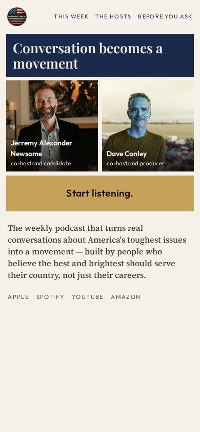
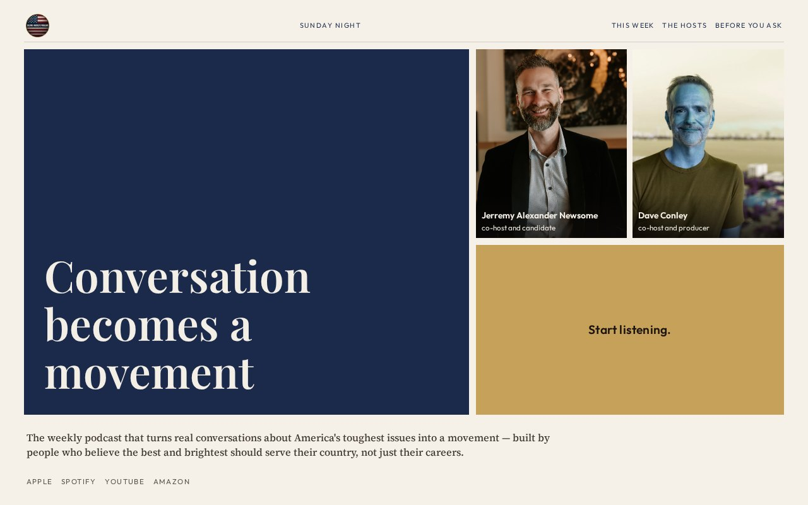

# 06 · Asymmetric Bento

**Move:** Magazine tiles. The button is a stamp-tile equal in weight to a photograph — not a leftover under a hero.  
**Why it wins with Jill over the others:** She reads like a magazine person. Uneven editorial composition is the opposite of a quiet-room landing page and the opposite of a SaaS feature grid.

## Still

**Phone (390×844)**

**Desktop (1280×800)**

## Feeling

Sunday magazine. Black dress. Gold, slate, scarlet. 3PM: I know what this is and I know where to tap. 3AM (unnamed): civic life can look like culture, not a campaign.

## Layout logic

Phone stacks uneven tiles:

1. Masthead (seal + labels). Issue line “Sunday night” is a date, not a hook.
2. Hook tile — navy field, Playfair, the locked hook
3. Two standing portraits, equal, name/role overlays
4. **Stamp tile — Start listening.** Gold, full width, equal to a photo
5. Locked sentence as typeset column
6. Platform whisper

Desktop: 12-ish magazine. Hook spans the left and down. Portraits and stamp stack on the right. Sentence runs the footer of the hero.

This is not a three-icon feature grid. Tiles are unequal on purpose.

## Named visual move

Asymmetric bento. The stamp is a tile.

## Palette

| Token | Value |
|---|---|
| Cream | `#F6F1E8` |
| Navy field | `#1B2A4A` (hook tile only) |
| Gold stamp | `#C6A15A` |
| Ink | `#1C1410` |
| Scarlet | lives in the wordmark |

Gold-blue-red keep. Navy is a tile, not a consulting site.

## Type

- Hook: Playfair Display
- Sentence: Source Serif 4
- UI / masthead: Outfit

## Navigation concept + labels

**Magazine masthead.** Listen lives in the stamp, never in the nav.

Proposed labels: **This week · The hosts · Before you ask**

Issue line: **Sunday night** — her actual listening hour, as a date, not as a slogan (the round-2 “Before Monday” hook is dead; this is not that hook).

## Section justifications (or cut)

- Hook tile — stop the scroll with editorial scale, not a banner.
- Portrait tiles — identification, equal, overlays from the 14 keep.
- Stamp tile — the act is a first-class object, not a leftover.
- Masthead without Listen — one decision per viewport.
- Funnel downstairs — last three episodes, then the rest, after the tap.

## Hard-fail check

- [x] Not a SaaS three-icon grid
- [x] Not a quiet-room remake
- [x] No circles / no green / no room photo
- [x] No guests above the button
- [x] Listen is the stamp, not a second nav item
- [x] Phone-first; stamp visible in 390×844
- [x] Locked copy
- [x] “Sunday night” is an issue line, not a replacement hook
