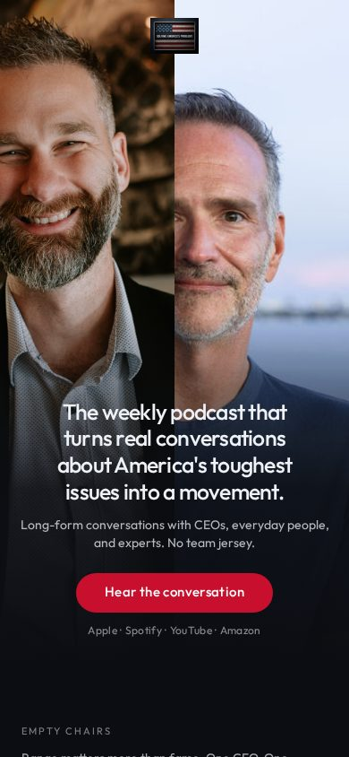
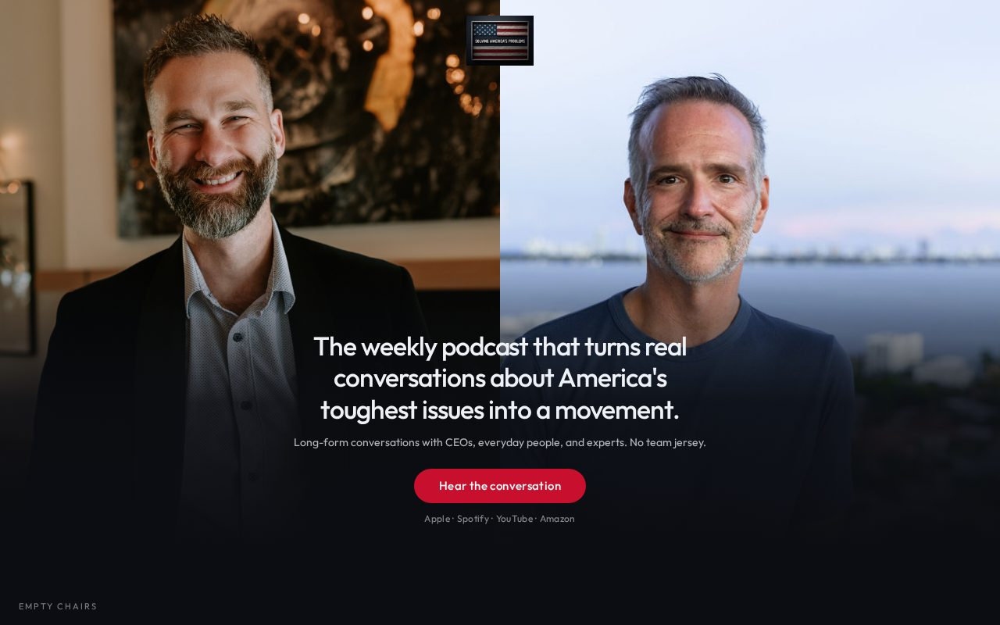

# 03 · Two Chairs

Load `_shared.md` first.

**Chip:** `#1e3a5f`  
**Register:** You walked into the room mid-conversation.

## Still

First viewport of the living mock. Real wordmark and headshots. v1.5 copy.

**Phone (390×844)**

**Desktop (1280×800)**

---

## Feeling

Two people, one table, no stage. She is not being pitched. She sat down and they were already talking. Equal partners. Not host-and-sidekick. Not a podcast thumbnail with a bigger face.

3PM: I can tell who is in the room.  
3AM (unnamed): I would not be the only adult at the table.

---

## Layout

- Split hero: Jerremy left, Dave right, full-bleed portraits.
- The sentence sits as the table between them — overlay at the bottom of the split, centered.
- Button centered as "sit down": `Hear the conversation`
- On a phone: still a split (two columns), not stacked faces that turn into a dating-app card.
- Below the fold: empty chairs for guests (proof slots), then manifesto, act, FAQ.
- Hosts' bios can be shorter here because the faces already did the introduction. Still include the locked bios in the footer.

## Key visual

Real headshots as equal partners. Navy polos, dark studio, the frames that already exist. No crop-to-circle. No name-superimposed-on-chest podcast art. Gradient from the portraits into a dark field that holds the sentence.

**Named frames for this brief (starting point, not "official forever"):**
- Jerremy: happy chest-up
- Dave: positive (standing/chest)

## Palette and type

| Token | Value |
|---|---|
| Background | `#0b0d12` |
| Foreground | `#eef1f6` |
| Accent | `#c8102e` (button only) |
| Type | Outfit. H1 ~1.55–2.1rem, centered over the join. |

Navy (`#1e3a5f`) may tint captions. Do not build a flag out of it.

## Copy on this page

- H1: the sentence
- Deck: proof line (`Long-form conversations with CEOs…`)
- Button: `Hear the conversation`
- Do not caption the hero with "Host" / "Co-host" in a way that ranks them. If you label, label after the fold.

## Story spine

1. Listen — two faces, one sentence, sit down.
2. Trust — empty guest chairs. The third seat is for a CEO, an everyday person, an expert.
3. Act — after she has heard the room.

## Assets

Hero is the photographs. Wordmark small, centered at the top, not competing with faces.

## Hard fail if

- One face is larger.
- Circle crops, fake studio lighting, or added flags behind them.
- It reads as campaign staff photography.

## Not these other directions

Not 08 (asymmetric elegance). Not 11 (two temperatures of *type*, not a split photo). Not 06 (magazine cover uses one portrait, not two).
