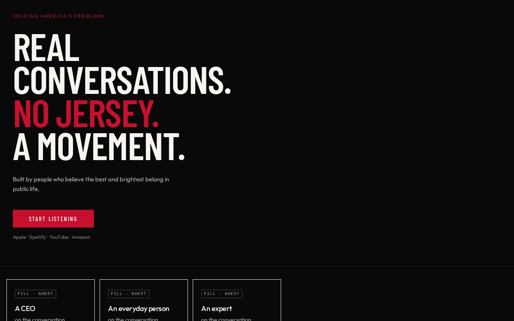

# 07 · Volume Up

Load `_shared.md` first.

**Chip:** `#c8102e`  
**Register:** Loss-song. Defiant, not sad.


## Still

First viewport of the living mock. Real wordmark and headshots. v1.5 copy.

**Phone (390×844)**


**Desktop (1280×800)**



---

## Feeling

The country's going sideways. She does not spiral. She turns it up. "I'm still here and I'm not done." Loud, driving, unapologetic. Not a eulogy. Not a protest poster that hates the audience.

3PM: this is not another lecture.  
3AM (unnamed): the window is not gone.

---

## Layout

- Full-bleed dark. Edge to edge.
- Condensed type slamming the left edge, architectural size.
- Button is the only bright object.
- Proof as a **fast horizontal clip** — three cards she can flick.
- The weekly act is a **full-width slab**, not a quiet link.
- FAQ and hosts after the slab, still dark.

## Key visual

Condensed gothic at architectural size. Red used as a **strike**, not a flag. Motion implied by type, not animation, not parallax, not a video hero.

A permitted condensation of the sentence as the display lines (the locked sentence must still appear as supporting copy):

```
REAL
CONVERSATIONS.
NO JERSEY.
A MOVEMENT.
```

"No jersey" may take the red strike. Do not add a fifth display line. Do not replace this with a political chant.

## Palette and type

| Token | Value |
|---|---|
| Background | `#090909` |
| Foreground | `#f7f4ef` |
| Accent | `#c8102e` |
| Display | Barlow Condensed, Arial Narrow. 3.4–6rem, uppercase, leading ~0.86 |
| UI | Outfit |

## Copy on this page

- Display lines: the condensation above
- Supporting: the second breath (locked)
- Button: `Start listening` — the bright object
- Act slab: "One specific act a serious person can take." + FILL

Do not write "fight," "war," "take back," or team colors.

## Story spine

1. Listen — the slam + the button.
2. Trust — fast clip of proof.
3. Act — the slab. This is the only direction where the act is allowed to be loud.

## Assets

No photographs required in the hero. If used, they sit under the type, dim, never competing. Wordmark can recede to a small caps name.

## Hard fail if

- Sad piano. Black ribbon. Tragedy-news aesthetic.
- American flag as texture.
- It looks like a rally flyer or a PAC.

## Not these other directions

Not 01 (still). Not 08 (win-song). Not 04 (breath vs slam). This is the loss-song. 08 is the win-song. Do not blend them.
