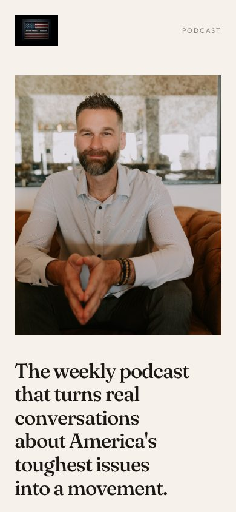
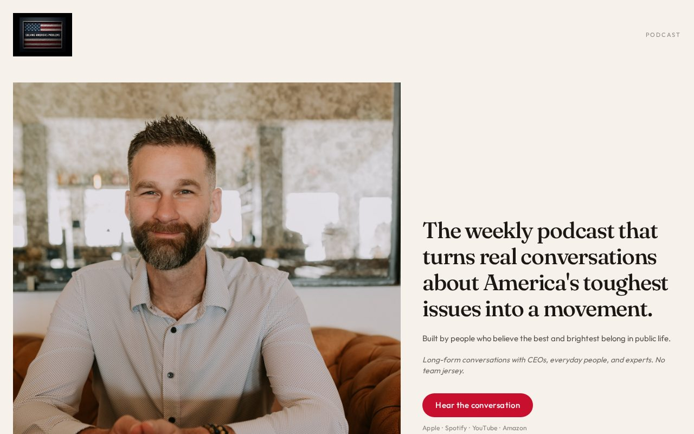

# 08 · Black Dress

Load `_shared.md` first.

**Chip:** `#d4c4b0`  
**Register:** Win-song. Argentine guitar. Good for the day and the night.

## Still

First viewport of the living mock. Real wordmark and headshots. v1.5 copy.

**Phone (390×844)**

**Desktop (1280×800)**

---

## Feeling

Fit, social, smart. The universal black dress of a page — works at 3pm and at 11pm. Sophistication without luxury-brand gloss. She would not be embarrassed to leave this open on a café table.

3PM: this is for someone like me.  
3AM (unnamed): participating would not make me smaller.

---

## Layout

- Asymmetric. A large photograph of the conversation (one host, or a two-shot that is *in conversation*, not a campaign handshake).
- Copy in a narrow elegant column. Generous margins. Lots of air.
- Dive-deeper as a **colophon**, not a link row — small, trailing, like the back of a book.
- Button is a single red thread, not a billboard.
- Proof as three quiet figures, not cards with borders.
- FAQ as running text, not a widget.

## Key visual

High-key studio. Light, not dark. A single red thread: PROBLEMS in the wordmark, and the button. Photography has air around it. Crop with respect — chest-up or seated, not a talking-head YouTube still.

## Palette and type

| Token | Value |
|---|---|
| Background | `#f7f3ee` |
| Foreground | `#1a1714` |
| Accent | `#c8102e` as a thread |
| Type | Newsreader for the sentence. Outfit for the column. Wide tracking on small caps labels. |

## Copy on this page

- H1: the sentence, in the narrow column, not giant
- Deck: the second breath
- Button: `Start listening`
- Colophon: Newsletter · @SolveUSAPodcast · Resources, each on its own line, small

Do not use fashion-brand copy ("essentials," "collection," "the edit").

## Story spine

1. Listen — photograph + column + button.
2. Trust — three quiet proof figures.
3. Act — a single line in the colophon area, given more weight than the links.

## Assets

High-key frames. Jerremy sitting happy or grateful chest-up; Dave sitting positive. Never the most intense "serious sitting" as the only image — that's 06/07 territory.

## Hard fail if

- Luxury gloss: gold, serifs-on-black, perfume-ad retouching.
- It looks like a hotel or a fashion ecommerce PDP.
- Red takes over the field.

## Not these other directions

Not 07 (loss vs win). Not 06 (paper briefing vs dressed room). Not 01 (lamp vs daylight).
