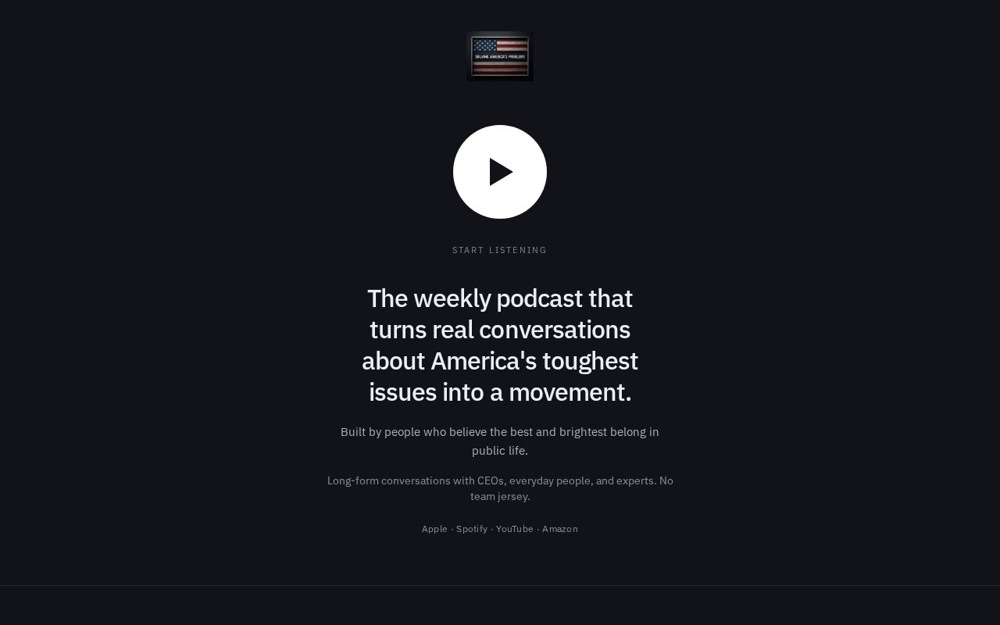

# 09 · Play

Load `_shared.md` first.

**Chip:** `#8a8f98`  
**Register:** Put the headphones on. This is a listen, not a landing page.

## Still

First viewport of the living mock. Real wordmark and headshots. v1.5 copy.

**Phone (390×844)**

**Desktop (1280×800)**

---

## Feeling

The room goes quiet. She came to hear something, not to evaluate a brand. The page should sound like a studio while remaining silent. One object: a play mark that *is* the subscribe button.

3PM: I know where to press.  
3AM (unnamed): an hour of this would not be noise.

---

## Layout

- Centered. Almost a device UI, without pretending to be Spotify.
- A large play mark. The mark is the button. It links to https://solving-americas.captivate.fm/listen
- The sentence sits under the control, not above it.
- Conversations appear as a **playlist**, not a carousel of faces: three rows, labeled A CEO / An everyday person / An expert, each with a play glyph and a FILL for the episode name.
- Manifesto, act, FAQ, hosts below the playlist.
- On phone: the play mark is thumb-sized and then some (64px+ hit area).

## Key visual

One object — a play mark. No waveform gimmick. No fake VU meters. No vinyl. No neon equalizer. A circle and a triangle is enough. Grey studio, not black-glass consumer-electronics.

## Palette and type

| Token | Value |
|---|---|
| Background | `#101114` |
| Foreground | `#ececec` |
| Accent | `#c8102e` on the play mark only |
| Type | Outfit. Neutral. The type should not perform. |

## Copy on this page

- Over the control, small: `Solving America's Problems`
- Under the control: the sentence
- Button label is the play mark; visually may include `Start listening` as a caption, not a second button
- Playlist rows: kind + "on the conversation" + FILL

## Story spine

1. Listen — the control.
2. Trust — the playlist (proof as episodes, still unnamed).
3. Act — one extra row at the bottom of the list: "This week" / the specific act.

## Assets

Wordmark optional; the play mark is the identity moment. No hero photography. Hosts in footer.

## Hard fail if

- Fake player chrome (progress bar at 32:14 of a fake episode).
- Waveforms, cassette tapes, neon.
- Two buttons (play *and* subscribe).

## Not these other directions

Not 12 (12 is a sticky subscribe bar on a reading page). Not 02 (sign). Not 05 (cards of people vs rows of listens).
