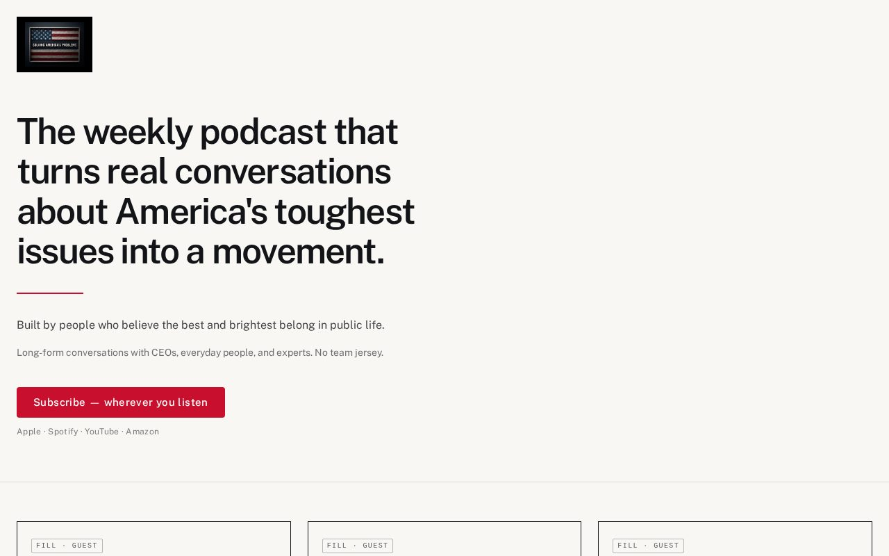

# 10 · The Rule

Load `_shared.md` first.

**Chip:** `#c8102e`  
**Register:** Service as a calling. Kennedy without the marble.

## Still

First viewport of the living mock. Real wordmark and headshots. v1.5 copy.

**Phone (390×844)**

**Desktop (1280×800)**

---

## Feeling

Classic American modern. Civic without becoming governmental. A thin red rule is the whole ornament. The best and brightest belong in public life — said as a fact, not as a contrast against anyone's job.

3PM: this is serious and clean.  
3AM (unnamed): public life still has a room for people like her.

**Internal note, not public copy:** this direction used to be verbally anchored on a rejected slogan. That slogan is gone. The visual (the rule) stays. Do not put the touchstone on the page as a headline.

---

## Layout

- Wide hero, left-aligned.
- Wordmark.
- The sentence.
- A thin red rule, ~2px, ~6–8rem long. Not a full-bleed bar. Not a flag stripe.
- One button.
- Proof as a **disciplined three-up**: CEO / everyday person / expert. Same height, same rules, no personality illustration.
- Footer is civic but not governmental — hosts, FAQ, quiet links. No seal. No address-to-Congress.

## Key visual

The red rule. One horizontal line borrowed from the logo, not from a flag. No columns, no eagle, no bunting, no navy field with gold stars. Helvetica-descended sans. Postwar civic modern, not 2020s campaign digital.

## Palette and type

| Token | Value |
|---|---|
| Background | `#f8f7f4` |
| Foreground | `#121417` |
| Accent | `#c8102e` — the rule and the button |
| Type | Public Sans. H1 ~2.4–3.2rem, semibold, tracking -0.035em, max ~18ch. |

## Copy on this page

- H1: the sentence
- After the rule: the second breath
- Then the proof line
- Button: `Subscribe — wherever you listen`
- Do not headline "Service as a calling." That is the feeling, not the H1.

## Story spine

1. Listen — sentence, rule, button.
2. Trust — three-up proof.
3. Act — a fourth, quieter rule, then the act.

## Assets

Wordmark on a black chip (the JPEG is reverse). Headshots only in footer, straight, unstyled, documentary.

## Hard fail if

- Flag, marble, gold, navy field, presidential seal energy.
- Any slogan that contrasts service with ordinary work.
- The red rule becoming a full-width stripe (that's a flag).

## Not these other directions

Not 02 (paint vs rule). Not 06 (magazine vs civic). Not 14 (14 removes almost all red; 10 uses the rule as the one red object besides PROBLEMS).
