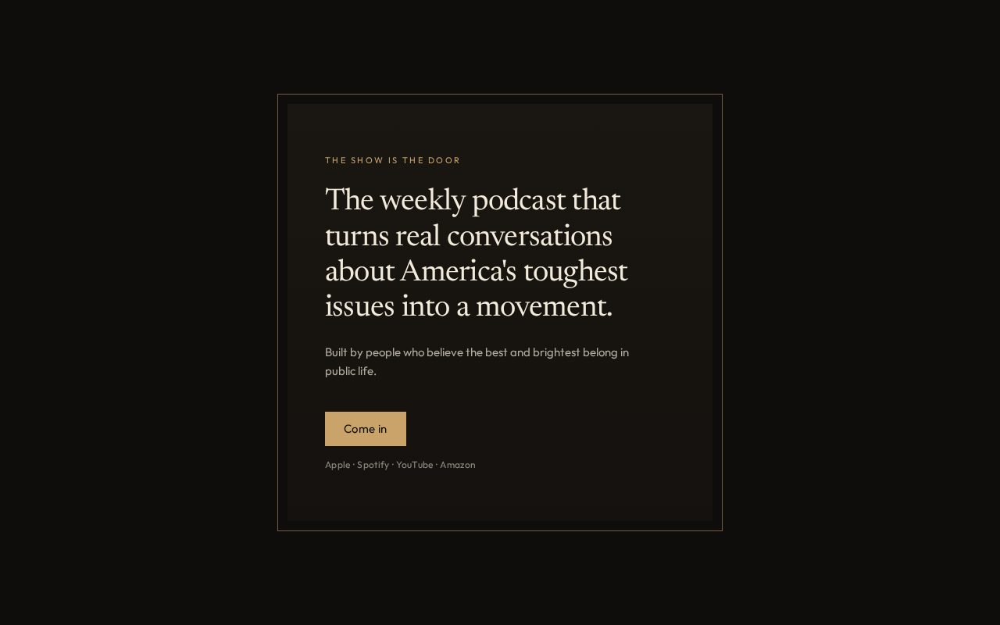

# 13 · The Door

Load `_shared.md` first.

**Chip:** `#c9a36a`  
**Register:** The show is the door. The movement is the product.

## Still

First viewport of the living mock. Real wordmark and headshots. v1.5 copy.

**Phone (390×844)**

**Desktop (1280×800)**

---

## Feeling

You don't see the whole house from the stoop. She is invited in, not briefed on the floor plan. The hero is a threshold. Below the fold, the house: proof, manifesto, the specific act as a room at the back.

3PM: I know how to come in.  
3AM (unnamed): there is a house, not just a show.

---

## Layout

- Full viewport dark surround.
- A lit rectangle in the center — CSS frame, not a stock photo of a door.
- Inside the rectangle: a small eyebrow (`The show is the door`), the sentence, the second breath, the button (`Start listening` / come in).
- Scroll down: the surround releases. Proof, manifesto, dive-deeper, act as interior rooms. FAQ and hosts last.
- Do not put the whole story inside the frame. The frame is the stoop.

## Key visual

A literal architectural frame around the sentence. Double line: an outer dark field, an inner gold hairline, a slightly lighter panel. No brass knocker. No Craftsman clip-art. No photograph of a door, a Capitol, or a White House.

## Palette and type

| Token | Value |
|---|---|
| Surround | `#0e0d0b` |
| Panel | `#1a1712` → `#14110e` |
| Foreground | `#f2eadb` |
| Accent | `#c9a36a` (threshold gold, not luxury gold) |
| Button on gold | dark text `#0e0d0b` |
| Type | Newsreader in the frame. Outfit for the eyebrow. |

Logo-red may appear only inside the wordmark if the wordmark is used; this direction's accent is the threshold gold.

## Copy on this page

- Eyebrow: `The show is the door`
- H1: the sentence
- Deck: the second breath
- Button: `Start listening`
- After the fold, a quiet label on the act: `A room at the back`

Do not write "join the house." Do not invent rooms (no "library," no "war room").

## Story spine

1. Listen — the stoop.
2. Trust — first interior room.
3. Act — the room at the back.

## Assets

No hero photo. Wordmark optional and small, inside the frame or omitted (the frame is the mark). Hosts inside, late.

## Hard fail if

- Stock architecture photography.
- Masonic, secret-society, or country-club door.
- Gold becomes luxury-brand gold.

## Not these other directions

Not 01 (lamp in a room vs a threshold into a house). Not 10 (civic rule vs architectural frame). Not 04 (the sentence *as* the building vs the sentence *behind* a door).
