# Visual directions — 15 briefs

Living briefs for the Solving America's Problems homepage bake-off.

These are **not** the site. They are fifteen complete directions, each with a still of the first viewport (phone + desktop), then feeling / layout / key visual. Dave sits as Jill, picks one, and the other fourteen get deleted. A design LLM should execute **one brief at a time**, not blend them.

## Stills

Phone, 390×844, first viewport. Click through for the full brief (desktop still + copy lock).

| # | Direction | Phone |
|---|---|---|
| 01 | [Sunday Night](01-sunday-night.md) | 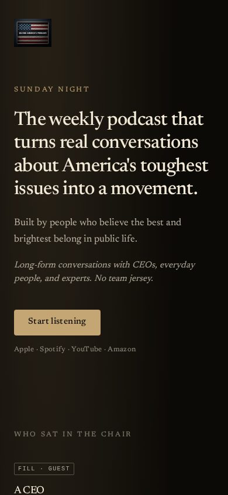 |
| 02 | [Shop Sign](02-shop-sign.md) | 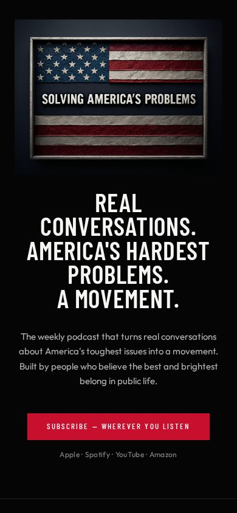 |
| 03 | [Two Chairs](03-two-chairs.md) |  |
| 04 | [The Sentence](04-the-sentence.md) | 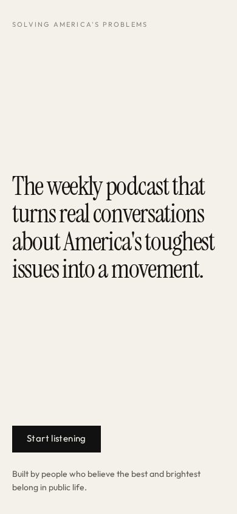 |
| 05 | [Proof First](05-proof-first.md) | 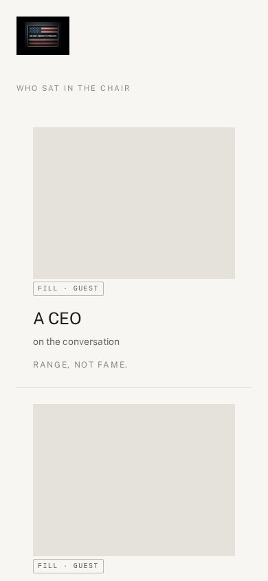 |
| 06 | [Briefing](06-briefing.md) | 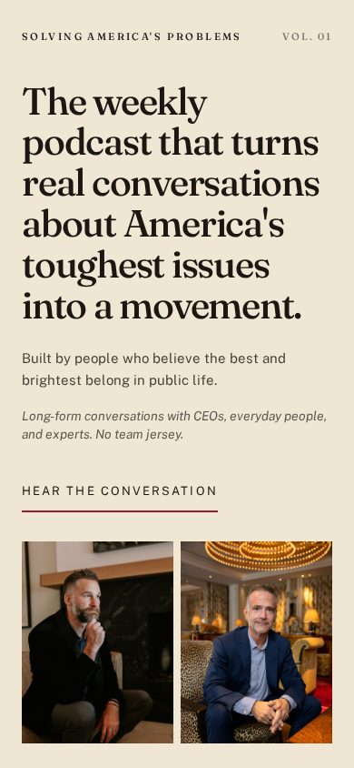 |
| 07 | [Volume Up](07-volume-up.md) | 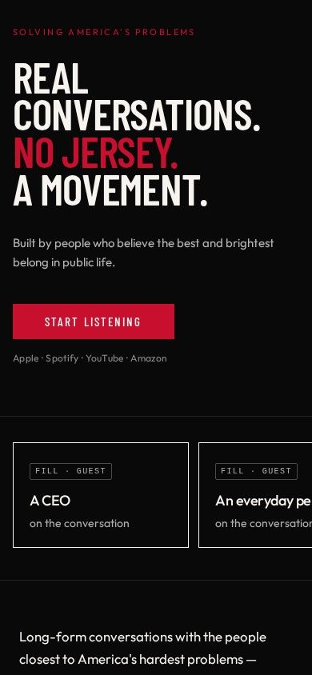 |
| 08 | [Black Dress](08-black-dress.md) |  |
| 09 | [Play](09-play.md) | 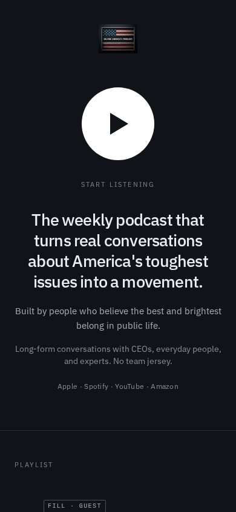 |
| 10 | [The Rule](10-the-rule.md) | 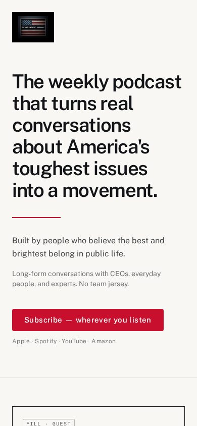 |
| 11 | [Hot / Cold](11-hot-cold.md) | 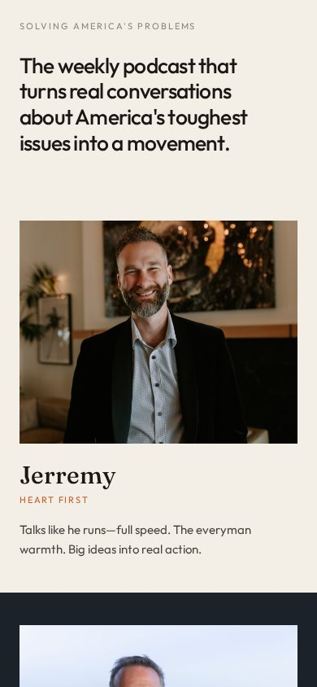 |
| 12 | [Thumb](12-thumb.md) | 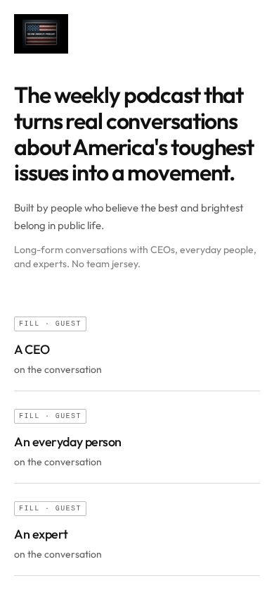 |
| 13 | [The Door](13-the-door.md) | 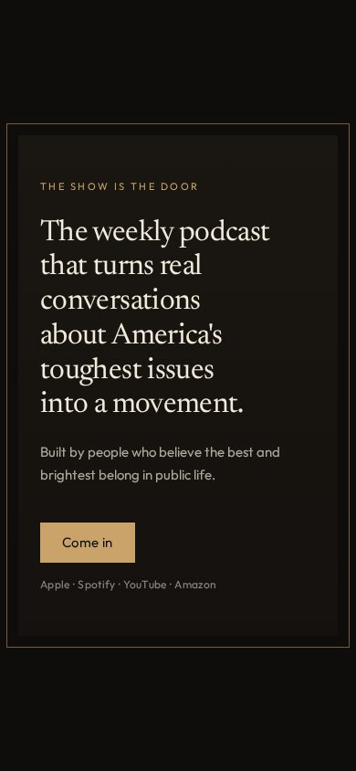 |
| 14 | [No Jersey](14-no-jersey.md) | 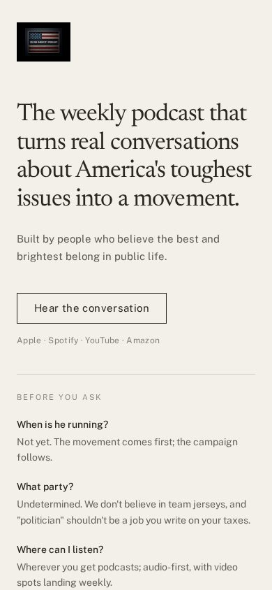 |
| 15 | [01 · 02 · 03](15-spine.md) | 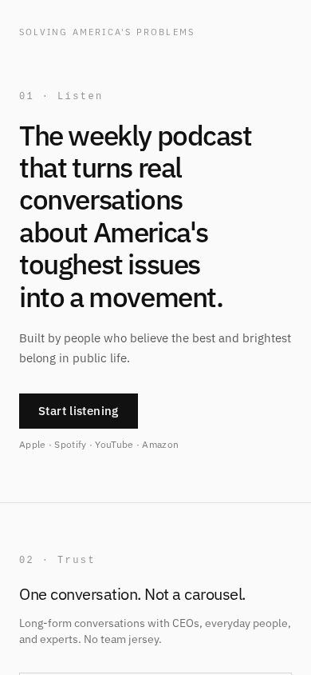 |

All stills live in [`stills/`](stills/). Desktop captures sit next to the phone files.

## How to use

1. Load `../build-manifest-v1.md`.
2. Load `../rosetta-stone.md` (pointer to Peters-Brain; currently v1.5).
3. Load [`_shared.md`](_shared.md) — copy lock, hard fails, story spine, fills.
4. Load **one** numbered brief.
5. Design that page. Phone first. One subscribe button above the fold.

If a brief and `_shared.md` conflict, `_shared.md` wins. If `_shared.md` and the stone conflict on identity, the stone wins — except public page copy, which is locked in `_shared.md`.

## Hard fail (read `_shared.md`)

Do not contrast service against ordinary work in headlines or treatments. Do not restore rejected taglines. Host name is **Jerremy**. Avatar is **Jill**. AI proposes; humans decide.

## Changelog

- v1.1 — 2026-08-30 — Phone and desktop stills of each living mock, embedded in every brief.
- v1.0 — 2026-08-30 — Fifteen full briefs from the living-mock bake-off, copy-locked to stone v1.5.
